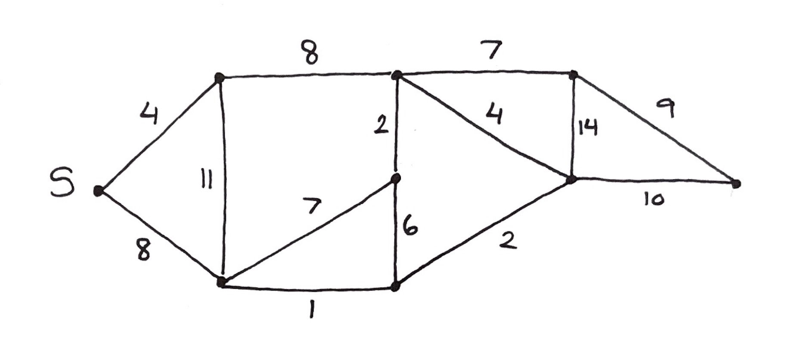
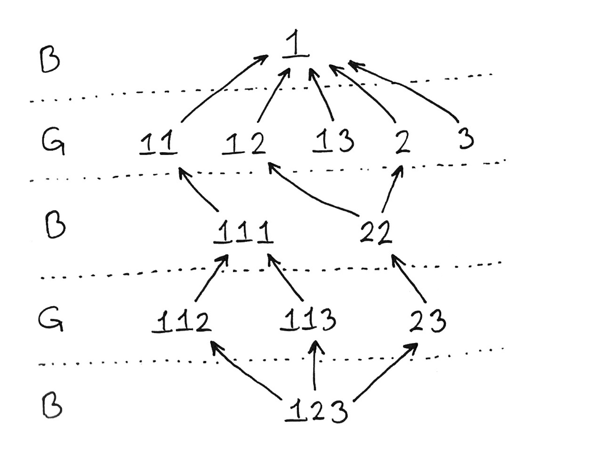

# Graphs

### Contents

1. [Definitions](#definitions)
2. [Depth First Search](#depth-first-search)
3. [Euler Tours](#euler-tours)
4. [Breadth First Search](#breadth-first-search)
5. [Dijkstra's Algorithm](#dijkstra's-algorithm)
6. [Minimum Spanning Trees](#minimum-spanning-trees)
7. [All Pairs Shortest Path Problem](#all-pairs-shortest-path-problem)
8. [Flow Networks](#flow-networks)
9. [Topological Sorting](#topological-sorting)

## Definitions

* **Notation:**

  * We represent a graph $G​$ as $G = (V,E)​$, where $V​$ is the set of all vertices and $E​$ is the set of all edges in the graph.
  * We represent an edge that goes from $u$ to $v$ as $(u,v)$. In an undirected graph, the order doesn't matter.

* **Directed Graph:** 

  * A graph where each edge has a direction, i.e. the edge can only be crossed one way.

* **Undirected Graph:**

  * A graph where each edge has no direction and can be crossed in both directions.

* **Directed Acyclic Graph (DAG):** 

  * A directed graph that has no cycles. 

  > **Theorem:**
  >
  > $G$ is a DAG $\Leftrightarrow​$ a DFS has no back edges
  >
  > $G$ is a DAG $\Leftrightarrow$ all DFS traversals have no back edges

* **Edge types: tree edges, back edges, cross edges**

  * Tree edge: an edge that is present in the DFS tree after a depth first search is run.

  * Back edge: an edge that leads to a vertex that has already been visited by DFS. More formally, it is an edge $(u,v)$ such that vertex $v$ is an ancestor of $u$, but $(u,v)$ is not part of the DFS tree. If a graph has back edges, then that graph must have at least one cycle.

  * Cross edge: an edge that points to a "dead" vertex, i.e. a vertex that has already had all of its children visited. 

    > **Theorem:** Undirected graphs have no cross edges.
    >
    > **Proof:**
    >
    > Consider some edge $(u,v)$ in the graph, and assume $u$ was discovered first. We have 2 cases:
    >
    > * Case 1: $u$ is visited and turns grey, then DFS visits $v$ next, which creates a tree edge.
    > * Case 2: DFS goes to another child of $u$ that is not $v$, and eventually visits $v$ from some other path. To check if $v$ is black, all of its neighbours are looked at; since $u$ is still grey, the edge $(u,v)$ is a back edge.
    >
    > Since these are the only 2 cases, this shows that cross edges cannot occur in an indirected graph. 

  <center><center/> 

* **Vertex Colours:**

  * White: the vertex has not yet been visited by DFS/BFS.
  * Grey: the vertex has been visited, but not all of its children have been visited yet.
  * Black: the vertex and all of its children have been visited.

## Depth First Search

DFS for graphs is similar to DFS for trees, but with graphs we have a few extra things to keep track of. Mainly, we must update vertex colours as DFS progresses, and we must also ensure no vertex is visited twice. It may be necessary to do multiple DFS traversals to get all vertices in a graph. 

The pseudocode is given below:

```java
// Set initial time
time = 0

func DFS(u) {
  	u.discoverTime = time + 1
  	u.colour = grey
  
  	for all v adjacent to u {
   			if v.colour = white {
      			v.parent = u
      			DFS(v)
    		}
  	}
  
  	time = time + 1
  	u.colour = black
  	u.finishTime = time
}
```

The time complexity of DFS is $O(|V|+|E|)$. Some properties are summarized below:

* A vertex $v$ is a descendant of $u$ if and only if $u$ is grey when $v​$ is discovered.
  * Alternatively, $v$ is a descendant of $u$ if and only if there is a path of white nodes to $v$ when $u$ is discovered.
* Nested property: the intervals $(d[u], f[u])​$ and $(d[v], f[v])​$ are either nested (i.e. one fully contained within the other) or disjoint.
  * $d[u]​$ = `u.discoverTime`
  * $f[u]$ = `u.finishTime`
* In DFS on undirected graphs, each edge is explored twice. 

## Euler Tours

With DFS in mind, we can now define the Euler tour:

> In an Euler tour, each **edge** in the graph must be visited *exactly once* and the tour must finish at the same vertex where it started. Vertices can be visited multiple times. 
>
> **Theorem:** A Euler tour exists if:
>
> * Undirected graphs: all vertices have even degree.
> * Directed graphs: the in-degree of all vertices is equal to the out-degree of all vertices.

Given a graph $G$, how can we find a Euler tour if one exists?

* We pick an edge and begin walking through $G$. If we find a cycle, we store that cycle away and remove the edges in the cycle from $G$ (vertices are never removed). 
* We repeat this until all cycles are found and all edges are removed from the graph. Then we must "splice" the separate cycles together to get the final Euler tour.

The entire algorithm is demonstrated in pseudocode below:

```java
// This gets one cycle at a time from the graph
func eulerWalk(u) {
  	MAKENULL(Q) // Initialize an empty queue
  	Q.enqueue(u)
  
  	v = u
  	v = delete(neighbour(v))
 		while v != u {
    		Q.enqueue(v)
    		// Advance v to next vertex and delete the edge that is crossed
    		v = delete(nextNeighbour(v))
 		}
 		return Q
}

// This returns the final Euler tour
func eulerTour(u) {
		MAKENULL(S) // Initialize empty stack
		S.push(u)
	
		while |S| > 0 {
    		v = S.pop()
    		if (nextNeighbour(v) = null) output v
    		else S.push(eulerWalk(v)) // This pushes all the vertices in the walk 
          												// into S
		}
}
```

Some notes:

* The Euler walk algorithm returns a cycle, e.g. `1 3 2 5 1`, which is stored in a queue.
* The Euler tour algorithm makes use of the Euler walk algorithm to get cycles in the graph. When a cycle is found, all of the vertices in the cycle are pushed onto the stack. 
  * A vertex will stay at the top of the stack as long as it has unvisited neighbours, since new cycles starting with that vertex will be pushed onto the stack.
* Euler tours are not unique, i.e. there can be multiple valid tours for a given graph.

The overall complexity of the algorithm is $O(|V| + |E|)$.

## Breadth First Search

In BFS, vertices are visited in order of distance from the source vertex. The algorithm is similar to BFS on trees, but with differences similar to DFS. The pseudocode is below:

```java
// s is the vertex we want to start from
func BFS(s) {
		// New for graph BFS
  	s.colour = grey
  	s.distance = 0
  	s.parent = null
  
  	MAKENULL(Q)
  	Q.enqueue(s)
  
  	while |Q| > 0 {
    		u = Q.dequeue()
    
    		for all neighbours v of u {
    				if (v.color = white) {
        				v.distance = u.distance + 1
        				v.colour = grey
        				v.parent = u
        				Q.enqueue(v)
    				}
				}
				output u
				u.colour = black
  	}
}
```

Like DFS, BFS has a time complexity of $O(|V|+|E|)​$. The algorithm creates a BFS tree consisting of tree edges. The "rings" or levels of the BFS tree are always unique, but the edges connecting the different levels are not unique. 

One application of BFS is determining if a graph is bipartite. A bipartite graph is defined as follows:

> A graph $G$ is bipartite if its vertices can be separated into two disjoint (non-overlapping) sets, say $A$ and $B$, such that there are no edges connecting two vertices in $A$ and no edges connecting two vertices in $B$. In other words, all edges go from $A$ to $B$ and vice versa.
>
> The following properties hold for bipartite graphs:
>
> * $G$ is bipartite $\Leftrightarrow$ $G​$ has no odd cycles
> * $G$ is bipartite $\Leftrightarrow$ $G$ is 2-colourable

To see if a graph is bipartite, we run a standard BFS and colour the vertices in the same level with the same colour. We use 2 colours and alternate for each level. Once this is done, we check each vertex to see if it has a neighbour of the same colour—if not, then the graph is bipartite. This takes $O(|V|+|E|)​$ time.

## Dijkstra's Algorithm

We now introduce **weighted** graphs. In a weighted graph, each edge has a certain weight associated with it, denoted by $w[u, v]$. Weights can represent things like cost, distance, capacity, etc. Given a weighted graph, there exist shortest paths where the sum of the edge weights in the path is minimal. We can search for different kinds of shortest paths:

* Given a vertex $s \in V$, find the shortest paths from each vertex in $V$ to $s$.
* Given vertices $s,t \in V$, find the shortest path from $s$ to $t$.
* Find all shortest paths for all pairs $s,t \in V^2$.

Dijkstra's algorithm allows us to find the shortest path from $s$ to $t$. The main idea is similar to BFS, except that we want to always visit the vertex that is closest to the source, i.e. the vertex of lowest weight. Each vertex has a "current" distance associated with it, which is initially set to $\infty$. As the algorithm progresses, this value is updated and denotes the length of the shortest path to get to the vertex from $s$. This is shown in the example below:

<center><center/> 

* Starting from vertex $S$, the lowest-weight path is 4, so the algorithm goes through that edge first:

  <center><center/> 

  > Note: the bottom vertex is not updated since $8 < 4 + 11$, which is the length of the other path to get to that vertex.

* Then, all vertices that can be reached from already-visited vertices are updated to have the lowest distance seen so far. The lowest-weight edge now is 8, so the next step is:

  <center><center/> 

* 9 is now the lowest-weight edge:

  <center><center/> 

* The algorithm continues down the bottom path, since 11 is the lowest:

  <center><center/> 

* Now 12 is the lowest-weight edge, so the algorithm goes there:

    <center><center/>

* At this point, the algorithm would continue doing this until all vertices are visited. At the end, the value for the desired vertex would be returned by the algorithm. In this example, the shortest path has length 21 from $S$ to the vertex on the far right.

Here is the pseudocode:

```java
func dijsktra(s) {
  	// Initialization
  	for all v in V {
    		v.parent = null
    		v.distance = inf
    		v.colour = white
  	}
  
  	s.distance =  0
  	MAKENULL(PQ) // We use a priority queue
  
  	for all v in V {
    		PQ.insert(v)
  	}
  
  	while |PQ| > 0 {
    		u = PQ.deleteMin()
    		u.colour = grey
    
    		for all neighbours v of u {
      			if (v.colour = white) {
        				if (u.distance + w[u,v] < v.distance) {
        						// A shorter distance has been found
          					v.distance = u.distance + w[u,v]
          					v.parent = u
          					PQ.decreaseKey(v, v.distance)
        				}
      			}
    		}
    		// u is part of the shortest path
    		u.colour = black
  	}
}
```

Now let's analyze the time complexity:

* The first for-loop takes time $O(|V|)​$
* Non-priority queue operations take time $O(|V|+|E|)$
* Priority queue operations:
  * Insertions: $O(|V|)$
  * Deleting Min: $O(|V|)$
  * Decreasing Keys: $O(|E|)$

The overall time complexity will depend on which implementation for a priority queue is used. This is summarized in the table below:

| **PQ Structure** | Insert   | DeleteMin  | DecreaseKey | Total |
| -------------- | -------- | ---------- | ----------- | ----- |
| Array          | $O(|V|)$ | $O(|V|^2)$ | $O(|E|)$ | $O(|V|^2)$ |
| Binary Heap    | $O(|V|)$ | $O(|V|log|V|)$ | $O(|E|log|V|)$ | $O(|E|log|V|)$ |
| Fibonacci Heap | $O(|V|)$ | $O(|V|log|V|)$   | $O(|E|)$ | $O(|E| + |V|log|V|)$ |
| K-ary Heap     | $O(|V|)$ | $O(k|V|log_k|V|)$ | $O(|E|log_k|V|)$ | $O((|E| + k|V|)log_k|V|)$ |

Using the Fibonacci heap gives the best time complexity for most graphs, since $|V| < |E|$ (usually). It should also be noted that Dijkstra's algorithm only works for graphs where there are no negative weight edges (see the Bellman-Ford algorithm for that).

## Minimum Spanning Trees

Suppose that we are given a weighted graph $G$. We define a minimum spanning tree (MST) as follows:

> A MST is a tree with all of the vertices from $G = (V,E)$, where the sum of all edges in the tree is minimal. It is denoted by $(V, E^*)$, where $E^* \subseteq E$.

If a graph has equal-weighted edges, then any tree is a MST. We also note the following properties about MSTs:

* **Cut property:** the shortest "bridge" from $A$ to $B$ *must* be included in the MST.
* **Cycle property:** the highest-weighted edge in a cycle is *not* included in the MST.

One algorithm for constructing a MST is the **Prim-Dijkstra algorithm**, which works as follows:

* The vertices in $G$ are separated into two sets $A$ and $B$. The set $A$ initially contains one vertex and $B$ contains all vertices in $G$ minus the vertex in $A$. As the algorithm progresses, vertices are removed from $B$ and added to $A$ until all vertices are in $A​$.
* We look at all edges from $A$ to $B$, and add the lowest weight one to our solution. The appropriate vertex is moved from $B$ to $A$.

The implementation of this algorithm makes use of a priority queue, which holds pairs like $(u, d[u])​$. The pseudocode is below:

```java
// u.distance = distance between u in B and nearest node in A
func MST(s) {
  	MAKENULL(PQ)
  	// s is the first vertex in set A
 	 	s.distance = 0
  
  	for all u != s {
    		u.distance = inf
    		// The priority queue contains all vertices in set B
    		PQ.insert(u, u.distance)
  	}
  
  	while |PQ| > 0 {
    		(v, v.distance) = PQ.deleteMin()
    		v.color = grey
    
    		for all neighbours u of v {
      			if (u.color = white) {
      					// We set all distance values to infinity initially so that
              	// this condition is met 
        				if (w[u,v] < u.distance) {
          					u.parent = v
          					u.distance = w[u,v]
          					PQ.decreaseKey(u, u.distance)
        				}
      			}
    		}
    		v.color = black
  	}
}
```

The complexity for Prim-Dijkstra is the same as for Dijkstra's shortest path algorithm.

Another algorithm for constructing a MST is **Kruskal's algorithm**:

* Unlike the Prim-Dijkstra algorithm, we look at *all* of the edges in the graph, and add them in order of smallest weight. We only add an edge if it does not create a cycle in our solution.  
* This also uses a priority queue, but it will be larger than in the Prim-Dijkstra algorithm.
* The time complexity is $O(|E|log|E|)​$.

MSTs can be used for some interesting applications; one of them involves finding an *approximate* solution to the Travelling Salesman Problem. By dynamic programming, we know we can get the optimal tour in $O(2^{|V|}|V|^2)$. However, we can find a solution that is not optimal, but is still acceptable with the help of MSTs. 

> Suppose $L^*$ is the length of the shortest TSP tour, and $L(A)$ is the TSP tour returned by the algorithm $A$. We say $A$ is a **C-approximation** if $L(A) < C \cdotp L^*$, regardless of the graph/data.   

Here is an algorithm that gives us a 2-approximation in polynomial time:

* Step 1: construct the MST for the graph (cheap)
* Step 2: order the vertices in preorder (extra cheap)
* Step 3: we return the tour $1,2,3…,n,1$
  * Note: this may not be possible!
  * There needs to be a **triange inequality**, i.e. $w[u,v] \leq w[u,z] + w[z,v]​$, for this tour to be possible. 

## All Pairs Shortest Path Problem

Given a weighted graph with a weight matrix $W​$, we would like to find the shortest path between all pairs of vertices in the graph. If $W[i,j] = \infty​$, then there is no edge between $i​$ and $j​$. We will look at several approaches below.

**Approach 1:** the Floyd-Warshall algorithm (dynamic programming).

Let $d[i,j,k]$ be the distance of the shortest path between vertices $i$ and $j$ via nodes of index $\leq k$, and let $p[i,j,k]$ be the pointer to this shortest path. We note that:

* $d[i,j,0] = w[i,j]$
* $p[i,j,0] = nil​$ if $w[i,j] = \infty​$ or $i=j​$
* $p[i,j,0] = j$ if $0 < w[i,j] < \infty$

Then, for all $k > 0$:

* $d[i,j,k] = min(d[i,k,k-1] + d[k,j,k-1], d[i,j,k-1])​$
* $p[i,j,k] = p[i,k,k-1]$ if $d[i,k,k-1] + d[k,j,k-1] < d[i,j,k-1]$
  * else $p[i,j,k] = p[i,j,k-1]$

The algorithm runs in $O(|V|^3)$ time and $O(|V|^2)$ space.

**Approach 2:** run Dijkstra's algorithm repeatedly.

For the Fibonacci heap implementation, the time complexity will be $|V|\cdotp O(|E| + |V|log|V|)$. For the array implementation, the time complexity will be $|V| \cdotp O(|V|^2)$.

> Note: both give a better runtime than the Floyd-Warshall algorithm.

## Flow Networks

A flow network is a directed graph $G$ with a designated **source** vertex $s$ and **sink** vertex $t$, and edges that each have a designated **capacity**. Additionally, we assume that each vertex in $G$ lies on some path from $s$ to $t$. 

> Note: for notation, if an edge has a capacity $c$ and a flow $f$ currently going through it, then we write $\frac{f}{c}$ beside the edge to indicate this.
>
> The current flow is called the **flow function**, and it is denoted by $f(u,v)$ for flow going from $u$ to $v$. Note that $f(u,v) = -f(v,u)$. 

The flow function must obey the following properties:

* Bounded: the flow through an edge cannot be greater than its capacity, i.e. $f(u,v) \leq c(u,v)$.
* Conservation: inflow must equal outflow for all vertices except $s$ and $t$.

We then can define the **value of the flow** on $G$ as the amount of flow leaving $s$/entering $t$.

Here is an example of a flow network:

  <center><center/> 

We can also extend the flow function to sets of vertices, say $A$ and $B$. This can be defined as:

$f(A,B) = \text{outflow from A} - \text{outflow from B}$

$= \sum_{u\in A} \sum_{v\in B}f(u,v) - \sum_{u\in B} \sum_{v\in A}f(u,v)$

Now, given all of these definitions, we turn to the main focus of this section: finding the *maximum* flow for a given graph. At first glance, we may be tempted to try a greedy algorithm, where we start with $f(u,v) = 0$ for all edges and find paths where we can put more flow. However, this doesn't work! It turns out that we need a way to undo "incorrect" decisions by removing flow from certain paths. 

The **Ford-Fulkerson method** gives us a way of computing the maximum flow for a flow network. The method works as follows:

* We build a **residual graph** $G_f$. Suppose we have an edge $(u,v)$ with $f(u,v) = 10$ and $c(u,v) = 15$. Then, we have 2 options: we can either remove 10 flow from the edge, or add 5 more. By having the option to remove flow, we can effectively "undo" incorrect decisions. 

  * Note: $|E_f| \leq 2|E|$
  * Essentially, to build the residual graph just think "*how much flow can I add, or take away?*"

    <center><center/> 

* If $u$ and $v$ have two edges between them, i.e. one going each direction, then the difference in flow must be considered when building the corresponding edges in the residual graph. Here is an example:

    <center><center/> 

* The method itself works similar to the greedy approach described earlier, but we will look at $G_f$ instead of $G​$ itself.
  * Start with all flows $f(u,v) = 0​$.
  * While there exists an augmenting path from $s$ to $t$, identify the capacity of that path (i.e. the maximum flow that can be pushed through it without going over capacity for any of the edges in the path). We denote this capacity by $f^*$.
  * Continue until there are no more augmenting paths left in $G_f$. To find augmenting paths, DFS can be used.

We will now look at **cuts** in flow networks. 

> A cut is a partition $A,B$ of the vertices in $G$ such that $s \in A$ and $t \in B$. The two sets must include all vertices in $G$.

The capacity of the cut is defined as:

$c(A,B) = \sum_{u \in A, v \in B} c(u,v)$

  <center><center/> 

We mention cuts since there is a relationship between cuts and flows in flow networks. We note the following properties:

1. If $f$ is any flow for a graph, and $(A,B)$ is any cut, then:

   $f = f(A,B)​$

2. If $f$ is any flow, then its value is bounded by the capacity of any cut:

   $f \leq c(A,B)​$

3. If for some flow $f​$ and some cut $(A,B)​$ we have $f = c(A,B)​$, then $f​$ is the **maximum flow** and the cut is the minimum of all cuts. This is referred to as "max flow-min cut".

> **Theorem:** a flow $f$ is maximal if there are no augmenting paths in the residual graph $G_f$.
>
> **Proof:**
>
> We want to show that:
>
> $f = c(A,B) \Leftrightarrow f \text{ is a maximum flow} \Leftrightarrow \text{no augmenting paths in $G_f$}$
>
> Most of this has already been proven (loosely) by the three properties above, so we will show that:
>
> $\text{No augmenting paths in } G_f \implies f = c(A,B)$.
>
> Let $A$ be the vertices we can reach from $s$ in the graph $G_f$, and all place all other vertices in $B$. Recall that to go through an edge in the residual graph, it cannot be at maximum capacity. There are no edges from $A$ to $B$, otherwise the vertex in $B$ would be in the set $A$. We know that:
>
> $f = \text{outflow from A} - \text{outflow from B}​$
>
> Now we can observe that, for all edges from $A$ to $B$ in non-residual graph $G$, the edges must be at maximum capacity; otherwise, we would be able to go from $A$ to $B$ in the residual graph. Likewise,  all edges from $B$ to $A$ must have zero flow going through them. 
>
> Therefore:
>
> $f = \sum_{u \in A, v \in B} c(u,v) - 0 = c(A,B)$

The overall time complexity of the Ford-Fulkerson method is $O(|E| \cdotp f)$. 

* Graph traversal (DFS) and edge updates take $O(|E|)$ time.
* The number of iterations can be as much as the final value of $f$, so $|E| \cdotp f$ is the upper bound.

The complexity above assumes *integer* capacities. The method still works for rational capacities, but it is not guaranteed to terminate for irrational capacities. 

## Topological Sorting

For this section, we will be looking at DAGs. 

* A **root** in a DAG is a vertex with no incoming edges.
* A **leaf** in a DAG has no outgoing edges.
* A tree is an example of a DAG.

DAGs all have one main property, which is the following:

> For every DAG, there exists a natural, linear listing of the vertices such that all edges point in the same direction (i.e. left to right). This is known as the **topological sorting**, or topological order.

In a topological sorting, vertices are ordered in *decreasing* order of their finish time. That is, vertices that are coloured black last will be first in the topological order. 

The pseudocode for the topological sort algorithm is below:

```java
func topologicalSortHelper(u, S) {
		u.colour = grey
	
		for all neighbours v of u {
    		if (v.colour = white) {
      			topologicalSortHelper(v, S)
    		}
		}
		// We only push vertices onto the stack when they are completed
		u.colour = black
		S.push(u)
}

func topologicalSort(u) {
  	// We use a stack
		MAKENULL(S) 
	
		// The helper should be called until DFS visits all vertices
		topologicalSortHelper(u, S)
	
		while |S| > 0 {
				// Pop all vertices off of the stack to get topological order
    		output S.pop()
		}
}
```

A few notes:

* The key ideas are to use a stack, and to push vertices onto the stack once they are completed, i.e. all of their neighbours are visited.
* This means that vertices that finish first are pushed into the stack first; however, when we pop off a stack, we get *reverse* order. This gives us the correct topological ordering, where the last finishing time comes first. 

* The complexity is $O(|V|+|E|)$.

Topological sorting can be used to find **strongly connected components** (SCCs) in graphs.

> We say two vertices $u,v$ are strongly connected if there exists a path from $u$ to $v$ **and** a path from $v$ to $u$. Vertices that are strongly connected form a strongly connected component.
>
> **Note:** there exists at least one "bridge" (i.e. edge) between strongly connected components. If we view these SCCs as "super nodes", then these bridges form a DAG structure. 

The following is an algorithm to find SCCs in a graph:

* Step 1: Get the topological ordering of the vertices in $G$.
* Step 2: Reverse all edges in $G$, and denote the new graph by $G^T = (V, E^T)$.
* Step 3: For all vertices $u$ in decreasing finishing time:
  * `if (u.colour = white) DFS(u) -> output DFS tree for u`
  * Each DFS tree will give us a strongly connected component!

Overall, this process takes time $O(|V|+|E|)$. To achieve step 2, we can use a simple trick if we are given an adjacency list:

* Suppose we have the following adjacency list:

  | Vertex | Adjacent Vertices |
  | ------ | ----------------- |
  | 1      | 2, 3, 4           |
  | 2      | 1, 3              |
  | 3      | -                 |
  | 4      | 1                 |

* Then, to get the adjacency list for $G^T$, we do the following for every vertex. Suppose vertex $u$ has neighbours $v_1, v_2…,v_n$. In the adjacency list for $G^T$, simply add $u$ to the adjacency list for $v_1,v_2…,v_n$ to get the desired result. Doing this on the example above gives us:

  | Vertex | Adjacent Vertices |
  | ------ | ----------------- |
  | 1      | 2, 4              |
  | 2      | 1                 |
  | 3      | 1, 2              |
  | 4      | 1                 |


Another application for topological sorting is **the game of Nim**. In this game, two players take turns picking up matchsticks, which are organized as follows:

* The matchsticks are placed in groups.
* A player can only remove matchsticks from only one group at a time, but they may remove as many as they'd like.
* We assume the groups increase in size from left to right. 

The player that picks up the last matchstick is the loser. Given this setup, we would like to determine whether we should go first or second so that we can always win. 

The first thing to note is that there are "Good" positions and "Bad" positions. If a player is in a Bad position, then they are guaranteed to lose (assuming the other player makes all the right moves). Conversely, if a player is in a Good position then they are guaranteed to win. 

The DAG below illustrates the connection between Good and Bad positions:

  <center><center/> 

Now, we would like to see an algorithm that can tell us, for each vertex in this graph, if we are in a Good or Bad position. This is illustrated with pseudocode below:

```java
// We assume that the queue contains the graph's vertices 
// in topological order
func nim(Q) {
  	while |Q| > 0 {
    		u = Q.dequeue()
    		kind[u] = Bad
      
    		for all v that can be reached from u {
      			if (kind[v] = Bad) {
      					// This is the move a player wants!
        				kind[u] = Good
     				}
    		}
  	}
}
```

The time complexity is $O(|V|+|E|)$ overall.

To finish this section off, we will mention one more application of DAGs: **PERT networks**. A PERT network has the following properties:

* Vertices represent points in time for an operation or project.
* Edges represent tasks with weights that denote the time required to complete them.
* A vertex can be only be completed if *all* incoming edges (tasks) are completed.
  * $time[v] = max_{u:(u,v) \in E}(time[u] + time[u,v])$
* There is a **critical path**, which is the path through the graph that takes the longest time to complete.
  * The critical path will always be equal to the total project time. 