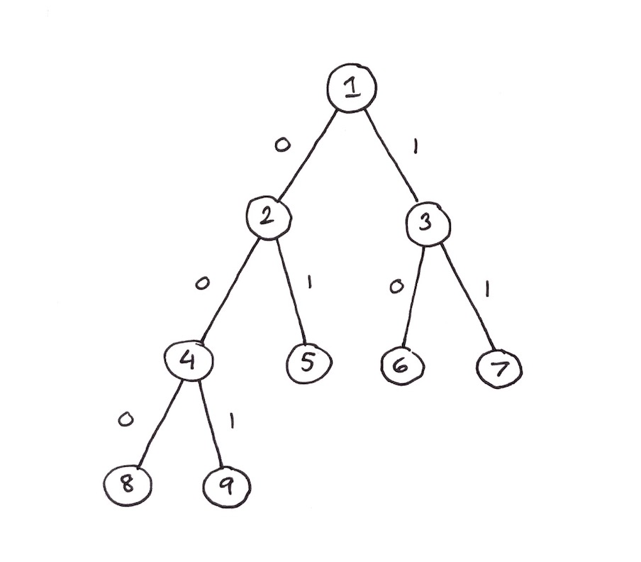
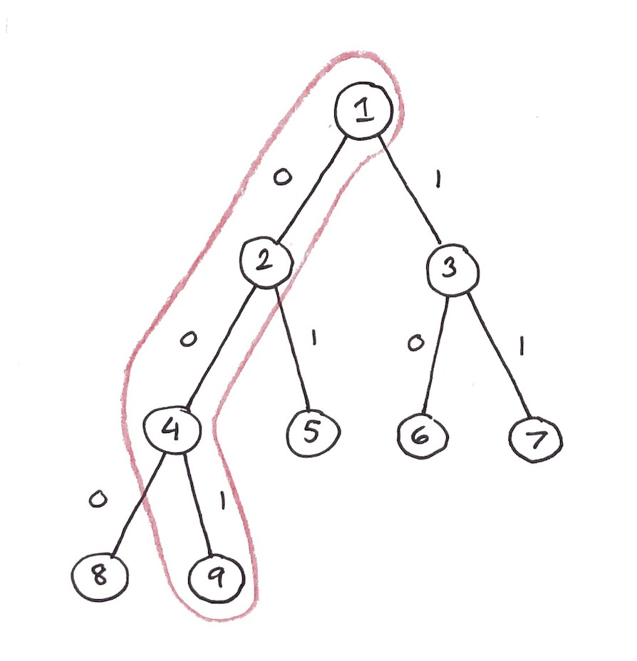
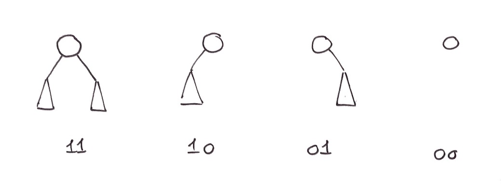
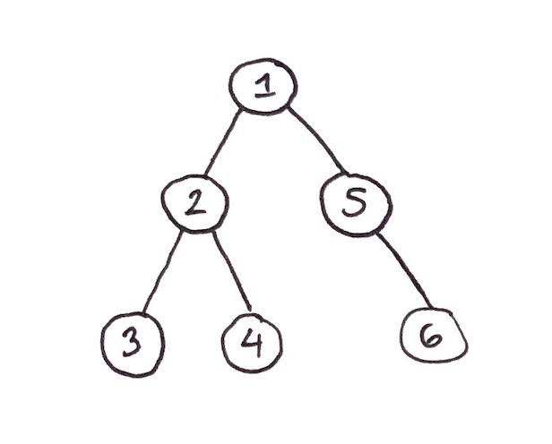

# Trees

### Contents:

1. [Introduction](#introduction)
2. [Complete Binary Trees](#complete-binary-trees)
3. [Traversals](#traversals)
4. [Binary Tree Storage](#binary-tree-storage)

## Introduction

We won't define trees too much here, since this concept is explained mainly in COMP 250. However, there are some special trees which we will cover below:

* **Complete (Binary) Trees:** a tree where every level is completely filled, except for possibly the last one. Each level must be filled from left to right.
* **Ordered Trees:** the children of a node have an order, and different orders represent different trees. To convert a binary tree to an ordered binary tree, the left child of each node becomes the first child of the current node in the ordered tree, and the right child of each node becomes the next sibling of the current node in the ordered tree. If the node numbers/keys increase when reading top-down and left to right (i.e. like a book) then the tree is properly ordered.

Trees are typically implemented via one of the following methods:

* **Tree Nodes:** for a binary tree, a Node type would be created with a key, left child pointer, right child pointer, and optional parent pointer. These nodes can be linked together arbitrarily to form a tree.

* **Arrays:** this is typically done for complete binary trees specifically, since there is a simple relationship that can be used to get a node's children:

  $node = array[i]​$

  $node[left] = array[2i]​$

  $node[right] = array[2i + 1]$

  $node[parent] = array[\left \lfloor{\frac{i}{2}}\right \rfloor ]​$

  This is an example of an *implicit data structure.* 

There are also a few properties that should be remembered for trees in general.

* A tree with $n$ nodes will always have $n-1$ edges.

* Let $n_i$ be the number of nodes with $i$ children (for binary trees, $i \leq 2$). Then:

  $n = n_0 + n_1 + n_2$ (number of nodes)

  $n-1 = n_1 + 2n_2$ (number of edges)

  $n_0 = n_2 + 1$

* The number of binary trees that can be created with $n$ nodes is $\frac{1}{n+1}\binom{2n}{n}$, which is also the $n^{th}​$ Catalan number. 

## Complete Binary Trees

There exists a trick that can be used to get the path to any leaf in a complete binary tree. This is shown with an example below:

<center><center/> 

Each left edge is labelled with a "0" and each right edge is labelled with a "1", as shown above. The trick to figure out the path to any leaf is as follows:

* Convert the leaf's key to its binary number representation, e.g. $6 = (110)_2$.

* Ignore the leftmost/most significant 1-bit and examine the remaining bits. Going from left to right, each bit represents the edge that should be taken to eventually get to the leaf.

Let's show this with a concrete example from the tree above. Say we want to get to node (9). First we convert 9 to its binary representation, which is $(1001)_2$. Ignoring the first bit, we're left with $(001)_2​$. Starting from the root, this gives the following path:

<center><center/> 

Which leads us to node (9), as expected.

To figure out the relationship between the number of nodes $n$ in a complete binary tree and its height $h$, we can observe the following:

$1 + 2 + 2^2 … + 2^{h-1} < n \leq 1 + 2 + 2^2 … + 2^h$

Where the left side represents a full binary tree of height $h-1$ and the right side represents a full binary tree of height $h$. After some rearranging, we get:

$2^h - 1 < n \leq 2^{h+1} - 1​$

$2^h \leq n < 2^{h+1}$

From this we see that $h = \lfloor{log_2n} \rfloor$ for a complete binary tree.

## Traversals

There are two main types of traversals that can be done on trees (which take time $\Theta(n))$:

* Depth-First Traversals (DFS)
  * Preorder, Inorder, Postorder
* Breadth-First Traversals (BFS)

The pseudocode for the 4 traversals follow below:

```java
func preorder(root) {
    if (root = null) return
    else {
        visit(root)
        preorder(root.left)
        preorder(root.right)
    }
}

func inorder(root) {
    if (root = null) return
    else {
        preorder(root.left)
        visit(root)
        preorder(root.right)
    }
}

func postorder(root) {
    if (root = null) return
    else {
        preorder(root.left)
        preorder(root.right)
        visit(root)
    }
}

// Implemented iteratively with a queue
func levelorder(root) {
	if (root = null) return null
	
	q = new queue() 
	q.add(root)
	
	while(!q.isEmpty()) {
        current = q.dequeue()
        visit(current)
        
        if (current.left != null) q.add(current.left)
        if (current.right != null) q.add(current.right)
	}
}
```

For any of the above traversals, each node in a tree will have a *traversal position*. For example, given the following tree:

```
	1
   / \
  3   5
     / \
    2   4
    
Preorder Traversal: 1 3 5 2 4 
```

The preorder position of node 5 would be 3, since it is the third element to be visited in the traversal.

If we are given the preorder or postorder positions of two nodes, say $u$ and $v$, we can use this information to figure out if $u$ is an ancestor or descendant of $v$. 

Depth-first search can also be implemented without recursion if we make use of a stack. This is shown below:

```java
// Preorder implementation
func iterDFS(root) {
    if (root = null) return null
    
    s = new stack()
    s.push(root)
    
    while (!s.isEmpty()) {
        current = s.pop()
        visit(current)
        
        if (current.right != null) s.push(current.right)
        if (current.left != null) s.push(current.left)  
    }
}
```

We can extend this even further by implementing a depth-first traversal with *no recursion or stacks*. This can be done by using parent pointers to "crawl" back up the tree like a recursive algorithm would.

```java
func preorder(root) {
	current = root
    while (current != null) {
        visit(current)
        current = next(current)
    }
}

func next(u) {
    if (u.left != null) return u.left
    else if (u.right != null) return u.right
    else {
        // v is always the node above u
    	v = u.parent
        
        // Crawl back up the tree
        while (v != null and (v.right = u or null)) {
            u = v
            v = v.parent
        }
        if (v = null) return null
        else return v.right
    }
}
```

A **Parsimonious Traversal** keeps the size of the recursion stack as small as possible while doing a preorder/postorder traversal.

* The main idea is to always push the larger subtree onto the stack first when looking at a node's two children—this way the smaller subtree will be processed first
* The smaller subtree will always have size $\leq \frac{n}{2^h}$
* This way, the stack size is always $\leq log_2n​$

## Binary Tree Storage

When we consider how we would like to store a binary tree, we will focus only on storing its *shape* and not necessarily the keys/labels of the nodes. Given this assumption, we can define the following mapping:

<center><center/> 


If we traverse a tree in preorder fashion, we can store the structure of the tree by inserting one of the four values above into the preorder listing, depending on where the children of a node are located. For example:

<center><center/> 

This tree would be stored as:

| Node     | 1    | 2    | 3    | 4    | 5    | 6    |
| -------- | ---- | ---- | ---- | ---- | ---- | ---- |
| Encoding | 11   | 11   | 00   | 00   | 01   | 00   |

From this, we can see that $2n​$ bits are required to store the shape of a binary tree. In general, this is the minimum number of bits required to store a binary tree.