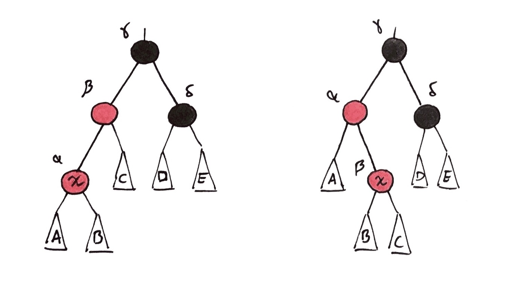

# Red-Black Trees

### Contents:

1. [Binary Search Trees](#binary-search-trees)
2. [Introduction and Definitions](#introduction-and-definitions)
3. [Red-Black Tree Operations](#red-black-tree-operations)
4. [Applications for Lists](#applications-for-lists)

## Binary Search Trees

A binary search tree (BST) is a binary tree with an additional restriction for each node. At any given node in a BST, the left child must be of lower value and the right child must be of greater value. This restriction makes it possible to search for values in a BST in a manner similar to binary search.

> At any given node in a BST, the left child must be of lower value and the right child must be of greater value.

The pseudocode for a recursive BST search is given below:

```java
// k is the value that is being searched for
func search(x, k) {
    if (x = null) return null
    else if (x.value = k) return x
    else if (x.value < k) return search(x.right, k)
    else search(x.left, k)
}
```

If a given BST is *balanced*, then the above algorithm takes time $O(log_2n)$. However, if the binary tree is skewed, then the worst-case performance is $O(n)$. Hence, it is important that the tree is balanced. 

## Introduction and Definitions

Red-black trees are one of the common types of balanced binary search trees. A node in a red-black tree is defined as follows:

```
type Node {
    parent : Node
    left   : Node
    right  : Node
    key    : (any type)
    colour : {Red, Black}
    rank   : int
}
```

Strictly speaking, both the rank and colour are not required to implement a red-black tree, but both will be used here. We also define *external nodes*, which are inserted wherever an actual/internal node does not have a child. We now introduce the "rules" for a valid red-black tree:

* External nodes are always coloured black and have rank 0.
* A red node cannot have another red node as its child or parent.
* Given a node $x​$, the rank for $x​$'s parent is determined as follows:
  * If the $x$ is black, then $rank[parent] = rank[x] + 1$
  * If the $x$ is red, then $rank[parent] = rank[x]$

If all of these rules are followed, then the tree is a valid red-black tree. Typically the root of the tree is coloured black, although this doesn't really matter. 

> **Proposition:** Every red-black tree is a valid binary search tree, but not every binary search tree is a valid red-black tree.

When given a binary search tree, it is possible that it can have multiple valid red-black trees. 

> **Proposition:** A red-black tree with $n$ internal nodes has $n+1$ external nodes.

We can now consider a *2-3-4 view* of a red-black tree. Since the rank does not change when going up from a red node to a black node, we separate a red-black tree into "levels" by rank (i.e. all nodes of rank 2 are on one level, all nodes of rank 3 are on the level above that, etc.). In this setup, red nodes appear between levels. 

When viewing a tree like this, there are four different *pods* that appear:

<center><center/> 


The numbers denote the number of edges on the bottom of the pods. The term "2-3-4 view" refers to these four pods. The bottom or $0^{th}$ level will contain all of the external nodes, and will always have $n+1$ nodes.

> $2^r \leq n+1 \leq 4^r $ 	

To see why the above is true, we can observe that every node on level $i$ will have between two and four descendants (including red nodes) on level $i-1$. Since all external nodes are descendants of the root, there will at least $2^r$ external nodes and at most $4^r​$.

> **Theorem:** For a red-black tree of height $h$ with $n$ internal nodes: $h \leq 2rank[root] \leq 2log_2(n+1)​$.

## Red-Black Tree Operations

We will look at five operations for red-black trees and their implementations:

* SEARCH
* INSERT
* DELETE
* SPLIT
* JOIN

SEARCH is a standard search on a binary search tree and has already been described earlier.

#### INSERT:

This method inserts a new node into its BST position in a red-black tree and ensures that it is still a valid red-black tree afterwards, which is done by another method called FIX.

When inserting a node, it must be coloured red. If no red-black tree conditions are violated, then the algorithm can terminate here. However, it is possible that the parent or children of the new node are also red, which is not allowed. Hence, we must FIX the tree. 

> **Note:** `node.gp` refers to the grandparent of `node` and `node.uncle` refers to the uncle of `node`, which is the sibling of the parent of `node`.

The pseudocode for FIX is below:

```java
func fix(x) {
    while (x.gp != null and (x.parent.colour = red) and (x.uncle.colour = red)) {
    		// Case 1
    		x.gp.rank = x.gp.rank + 1
    		// Change colours to match new rank
    		x.parent.colour = black
    		x.uncle.colour = black
    		x.gp.colour = red
    		// Move up and repeat as many times as necessary
    		x = x.gp
    }
    if (x = root) {
        return // Halt
    } else if (x.parent = root and x.sibling.colour = red) {
        // Case 2
        x.parent.rank = x.parent.rank + 1
        x.colour = black
        x.sibling.colour = black
        return
    } else if (x.parent.colour = black) {
        return // Halt, nothing left to fix (case 3)
    } else {
        // x.parent.colour = red and x.uncle.colour = black (case 4)
        rotation(x) // See definition below
        return
    }
}
```

The four cases seen above can be visualized with the following examples:

<center><center/> 

These are the key points for each case:

* Case 1: 
  * $x$ has a grandparent
  * $x$'s parent is red
  * $x​$'s uncle is red
* Case 2:
  * $x$'s parent is the root of the tree
  * $x$'s sibling is red
* Case 3:
  * $x$'s parent is black and isn't the root
* Case 4:
  * $x$'s parent is red
  * $x​$'s uncle is black

We now define the function ROTATE. The two possible cases, excluding symmetries, are shown below:

<center><center/> 


Where A-E represent the subtrees of their respective nodes. The goal of a rotation is to finish with no two adjacent red nodes and also to preserve the inorder traversal order of the tree. It turns out that both cases lead to the following result:

<center><center/> 


In all of the trees above, A-E are always filled in from left to right. A rotation takes $O(1)$ time, while the FIX algorithm takes time $O(logn)$ from the while loop and makes at most one call to ROTATE.

#### DELETE:

We define DELETE as the standard delete for a binary search tree followed by a FIX. However, we can also define a LAZY DELETE, which can be done as follows:

* Instead of actually removing a node, simply mark it as "deleted".
* Once 50% or more of the nodes in the tree are marked as deleted, find all of the non-deleted nodes with an inorder traversal in time $O(n)​$ and then build a new tree consisting of those nodes in time $O(n)​$, which is possible when the nodes are sorted.
* It is sufficient to make the new tree a complete binary tree and make the leaves red and all of the other nodes black.

#### SPLIT:

This algorithm takes a tree and a key $k$ and returns two trees, $T_1$ and $T_2$, where every element in $T_1$ is less than $k$ and every element in $T_2$ is greater than $k$. 

The pseudocode for constructing $T_1$ is below:

```java
func split(x, k) {
    // Find the node to split at
    kNode = search(k)
        
    /*
    * Keep track of all nodes with key smaller than or equal to k, and also keep
    * track of their respective left subtrees. 
    *
    * Let A be the subtree and let p be its left subtree. Note that p1 has key k.
    */
    
    // Repeatedly join subtrees from left to right
    s2 = join(A, p2, A2)
    s3 = join(s2, p3, A3)
    ...
    si = join (si-1, pi, Ai)
    
    T1 = si
    return T1
}
```

The construction of $T_2$ is the same, but symmetric. SPLIT takes time $O(logn)$ overall.

#### JOIN:

This algorithm takes in two red-black trees, $T_1$ and $T_2$, where every element in $T_1$ is smaller than every element in $T_2$, and returns a new red-black tree with their combined elements.

The first step is to find the minimum value in $T_2$ and remove it (call it $d$). Then, we denote the rank of the root of $T_2$ by $r$. The next step is to find an element of equal rank to $r$ on the right *roof* (the rightmost path) of $T_1$ and delete the edge from that node to its parent. Then, create new edges as follows:

* Connect $d$ to the root of $T_2$ and the element of equal rank in $T_1$. These two are the new children of $d​$.
* Connect $d$'s parent pointer to the node of rank $r+1$ above the element of equal rank in $T_2$.

The pseudocode for the entire algorithm is below:

```java
func join(t1, t2) {
		// Find the minimum element in t2
    d = min(t2)
    // Delete d from t2 and fix the tree
    delete(t2, d)
    
    r = rank(t2.root)
    // Find a node of rank r on the right roof of t1
    roofNode = find(t1, r) 
    
    // Make all appropriate edges/adjustments
    d.colour = red
    d.rank = r + 1
    d.left = roofNode
    d.right = t2.root
    d.parent = roofNode.parent
    roofNode.parent = d
    
    // Fix to ensure the new tree is a valid red-black tree
    fix(d)
    // d is the root of the new joined tree
    return d
}
```

Finding the node on the right roof takes time $O(logn)$, and fixing up the tree also takes time $O(logn)$. The overall algorithm takes time $O(logn)$.

## Applications for Lists

Lists are typically implemented in one of two ways: with an array or a (singly) linked list. The time complexity for various list operations depends on the implementation, and this is shown below:

| Operation               | Array  | Linked List |
| ----------------------- | ------ | ----------- |
| Sublist from $i$ to $j$ | $O(1)$ | $O(n)$      |
| Concatenate 2 lists     | $O(n)$ | $O(1)$      |

The implementation that is chosen largely depends on the context and which operation will be used more often. However, we can also implement a list using a red-black tree, namely with the SPLIT and JOIN operations, which are analogous to the Sublist and Concatenate operations. With a red-black tree, the time complexity for both operations is $O(logn)$.