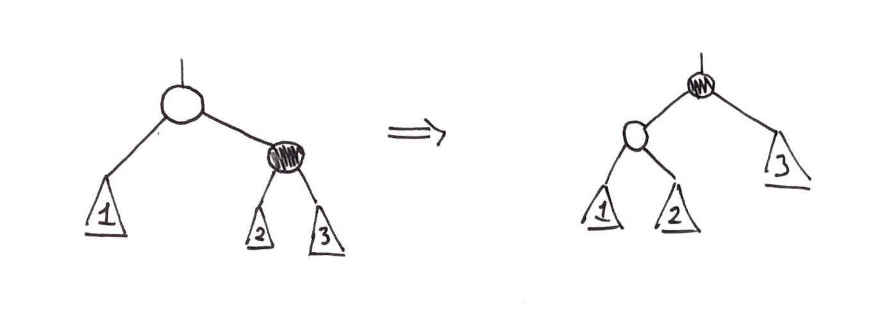
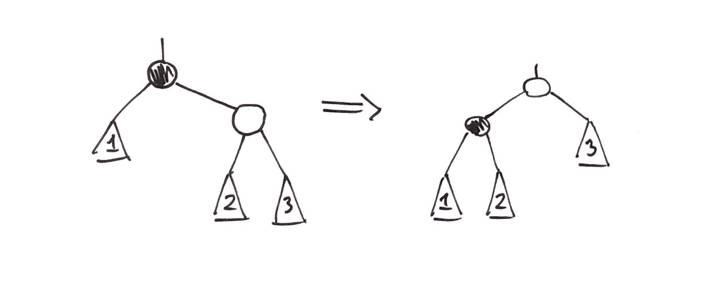

# Augmented Data Structures

### Contents

1. [Order Statistic Trees](#order-statistic-tree)
2. [Interval Trees](#interval-tree)
3. [K-d Trees](#k-d-trees)
4. [Binary Space Partition Trees]($binary-space-partition-trees)
5. [Cartesian Trees](#cartesian-trees)

## Order Statistic Trees

In this type of tree, we have the following properties:

* Nodes have keys

* The operations are `insert(k)`, `delete(k)`, `search(k)`, `select(k)` and `rank(x)`, and all take time $O(logn)​$ 

* Rank refers to the order position of a node, **not** the rank in a red-black tree!

* A node is defined as follows:

  ```
  type Node {
      parent : Node
      left   : Node
      right  : Node
      key    : (any type)
      color  : {Red, Black}
      size   : int // size of subtree under node, including itself
  }
  ```

To maintain the size field of every node, the size must be increased by 1 for every ancestor of a newly inserted node and decreased by 1 for a deleted node.

Pseudocode implementations for several algorithms can be found below:

```java
// This algorithm finds the k-th smallest key in the tree
func select(k, root) {
    if (root = null) return -1
    else {
        if (root.left = null) rank = 1
        else rank = root.left.size + 1
        
        if (k = rank) return root
        else if (k < rank) then select(k, root.left)
        else select(k-rank, root.right)
    }
}

// This algorithm computes the rank of x
func rank(x, root) {
    // The total number of elements smaller than x plus 1 gives the rank of x
    r = x.left.size + 1
    // We need 2 pointers to move up the tree
    y = x
    
    while (y != root) {
        // Check if y is the right child of its parent
        if (y.parent.right = y) {
            r = r + 1 + y.parent.left.size
        }            
        y = y.parent
    }
    return r
}
```

## Interval Trees

In this tree, we have the following properties:

* Each node has an interval with a *low* and a *high* value

* Operations: `insert(i)`, `delete(i)`, and `overlap(i)`, which all take time $O(logn)$

* A node is defined as follows:

  ```
  type Node {
      parent : Node
      left   : Node
      right  : Node
      low    : int
      high   : int
      key    : either low or high
      color  : {Red, Black}
      max    : int // maximum high interval value in subtree
  }
  ```

`insert` and `delete` are implemented in the same way as for standard red-black trees. The `overlap(i)` method returns true if $i$ overlaps with any other interval in the tree and false otherwise. We will assume that the lower bound of each interval is used as the key.

```java
func overlap(i, root) {
    if (root = null) {
        return false
    } else if (intersects(i, root.low, root.high)) {
        return true
    } else if (i.low < root.left.max) {
        return overlap(i, root.left)
    } else {
        return overlap(i, root.right)
    }
}
```

One application of intervals trees relates to computer chip design. Given a board and the positions of chips on it, we can use the **sweepline algorithm** to determine if any of the chips overlap. Each chip on the board has two sets of endpoints: $(x_i, y_i)$ on its vertical axis and $(a_i, b_i)$ on its horizontal axis. The pseudocode is given below:

```java
// Returns true if any chips overlap
func sweepline(chips) {
	// Create an empty interval tree for use below
	intervalTree = new intervalTree() 

    // We assume the endpoints in chips are already sorted
    for (chipPoint in chips) {
        if (chipPoint is some a_i) {
            if (overlap((x_i, y_i), intervalTree)) {
                return true
            } else {
                insert((x_i, y_i), intervalTree)
            }
        } else if (chipPoint is some b_i) {
            delete((x_i, y_i), intervalTree)
        }
    }
}
```

The general idea of the algorithm is to add intervals $(x_i, y_i)$ to the tree once we see some $a_i$, i.e. the horizontal start of a chip, and to remove intervals when we see some $b_i$, i.e. the horizontal end of a chip. Keeping intervals in the tree this way implicitly checks overlap on the horizontal axis, and then we can explicitly check overlap on the vertical axis to complete the algorithm.

## K-d Trees

Short for k-dimensional trees, this data structure organizes points in k-dimensional space. The properties for k-d trees and other similar trees are:

* Operations: `insert`, `delete`, `partialMatch`, `rangeSearch`.
* `partialMatch` searches for a coordinate $(x,y)$ for an exact match, and can also search for a specific $x$ or $y$ only for a partial match. 

For the examples below, we will focus on a 2-dimensional k-d tree. The nodes on odd levels (including the root) split the data vertically (i.e. by x-coordinate) and nodes on even levels split data horizontally (i.e. by y-coordinate). 
Every leaf in the tree represents a region that is created from these various split operations. K-d trees generally are not implemented with red-black trees since it is too difficult to do.

One of the useful operations that can be done with a k-d tree is a range search, which returns all of the points that lie within a specified area. In 2D space, this area is a rectangle. The pseudocode for this algorithm is given below:

```java
func rangeSearch(R, root) {
    if (root != null) {
        if (R.contains(root.point)) output root

        output rangeSearch(R, root.left)
        output rangeSearch(R, root.right)
    } else {
        return
    }
}
```

This algorithm runs in $O(n)$ time.

Aside: A quadtree is very similar to a k-d tree, with the main difference being that it is a 4-ary tree.

## Binary Space Partition Trees

A Binary Space Partition (BSP) tree is used to figure out which objects to render in a "scene", and has applications in video games and computer graphics. Given the position of some camera/audience, we would like to efficiently return which objects in a given set are visible from that position. For the notes below, we'll deal with 2D shapes positioned on a 2D plane.

The idea behind constructing a BSP tree is as follows:

* Given a set of shapes, we insert *numbered* lines such that each shape is contained in its own "region".
* Each line corresponds to a node in the BSP tree and contains two sides: the side visible from the viewer's perspective (+) and the far side which is not visible by the viewer (-). These two sides are the edges that connect a node to its children.
* When a line contains only one shape on its side, that shape is inserted as a child leaf on the appropriate side.
* All leaves in a BSP tree are shapes. 

Once the tree is constructed, the **Painter's algorithm** allows us to traverse the tree for a given viewer angle and retrieve which shapes are visible. 

## Cartesian Trees

A Cartesian tree is a binary tree that stores data of the form $(x,y)$, where $x$ is any standard key for a binary search tree and $y$ is the **priority** or timestamp of the key. Given this, we can define the following properties for a Cartesian tree:

* Each node in the tree contains one key and one priority.
* The tree is a BST with respect to $x​$.
* The tree is a min (or max) heap with respect to $y$ (or equivalently, all paths from root to leaf have increasing $y$ values).

When given a set of coordinates, a Cartesian tree can be constructed as follows:

* Pick the highest priority item remaining (either lowest or highest $y$ value) and insert it into the tree in its proper BST position.
* Once a coordinate is inserted, it can be removed from the original set of coordinates.
* Keep inserting in order of priority until all coordinates are inserted.

We can observe that for a given set of coordinates, the constructed Cartesian tree is guaranteed to be unique, since there is only one way to construct it. However, constructing the tree in this manner can lead to a skewed tree with height $n-1$ in the worst case. To fix this issue, we randomize the priorities of the keys to get a reasonably good probability of achieving a balanced tree.

#### Treaps:

Treaps stem directly from Cartesian trees. Say we are given a set of keys $x_1$ to $x_n$. We can generate random priorities in the range $[0,1]$ and assign one per key to get a **random binary search tree**.

While treaps are not guaranteed to be fully balanced, they do have height $O(logn)$ on average. 

#### Cartesian Tree Operations:

The key operations for Cartesian trees involve fixing the tree when one element is out of place. Since a Cartesian tree has the heap property, we are concerned with moving the out-of-place element either up the tree (fix-up) or down the tree (fix-down). To do this, we will define two types of rotations below.

We will define the **fix-up** rotation first. The need for this method arises when a node's parent has a larger priority, thus violating the heap property, but the keys are well sorted and their order must be preserved. The diagram below shows an example of this rotation:

<center><center/> 

Where the black node is the node that is out of place. The pseudocode for this operation is given below:

```java
func fixup(badNode, root) {
	// If either condition below is true, then the tree is fixed
    while (badNode != root and badNode.priority < badNode.parent.priority) {
        p = badNode.parent
        
        if (p.right = badNode) {
            p.right = badNode.left
            badNode.left = p
            badNode.parent = p.parent
            p.right.parent = p
            p.parent = badNode
        } else {
            p.left = badNode.right
            badNode.right = p
            badNode.parent = p.parent
            p.left.parent = p
            p.parent = badNode
        }
    }
}
```

The other operation that can be done to fix a Cartesian tree is the **fix-down** operation. An example of this rotation is given below:

<center><center/> 

In this operation, the bad node moves down the tree instead of up. The logic is very similar to the previous algorithm, but there are a few differences:

* We must check if the bad node has become a leaf (instead of the root).
* We must move the smaller of the bad node's children up to satisfy the heap property.

With these two things in mind, the pseudocode is given below:

```java
func fixdown(badNode, root) {
    while (badNode != leaf and (badNode.priority > badNode.left.priority or 					badNode.priority > badNode.right.priority)) {
        // We check which child is smaller
        if (badNode.right.priority > badNode.left.priority) {
            temp = badNode.left
            badNode.left = temp.right
            temp.right = badNode
            temp.parent = badNode.parent
            badNode.left.parent = badNode
            badNode.parent = temp
        } else {
            temp = badNode.right
            badNode.right = temp.left
            temp.left = badNode
            temp.parent = badNode.parent
            badNode.right.parent = badNode
            badNode.parent = temp
        }
    }
}
```

With these two operations defined, we can now define the remaining Cartesian tree operations:

* **`insert(root, (x,y))`**: given a pointer to the root of the tree and the coordinate to insert, the trick is to set the new coordinate's priority to $\infin$. This way, it will be a leaf in the heap and it can be inserted as in a standard BST. Once it is inserted as a leaf, its priority can be updated to its original value and `fixup` can be used to move it up to its proper position.
* **`delete(root, node)`**: given a pointer to the root of the tree and the node to delete, set the priority of `node` to $\infin$ and move it down the tree using `fixdown`. Once it becomes a leaf, it can easily be deleted.
* **`join(t1, t2)`**: given pointers to the roots of two different Cartesian trees, where all keys in $t_1$ are less than $t_2$, the goal is to join them into one Cartesian tree. The trick is to create a temporary node with key $k$ and priority $- \infin$, where $maxKey(t_1) < k < minKey(t_2)$. Then, set the temporary node's left child to $t_1$ and set its right child to $t_2$. Once this is done, the temporary node can be deleted to fix the tree up and get the final result.
* **`split(root, k)`**: given a pointer to the root of the tree and a value $k$ to split by, the goal is to return two Cartesian trees such that $maxKey(t_1) < k < minKey(t_2)$. To do this, insert a temporary node $(k, - \infin)$ into the tree. Since it has the lowest possible priority, it will be pushed up to the root position to preserve the heap property of the tree. Then, the two children of the temporary node will be the two desired trees. 