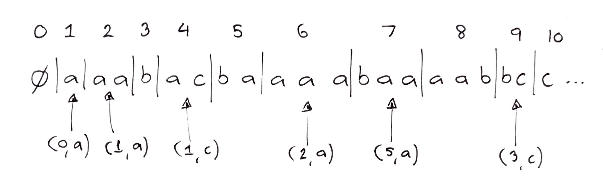
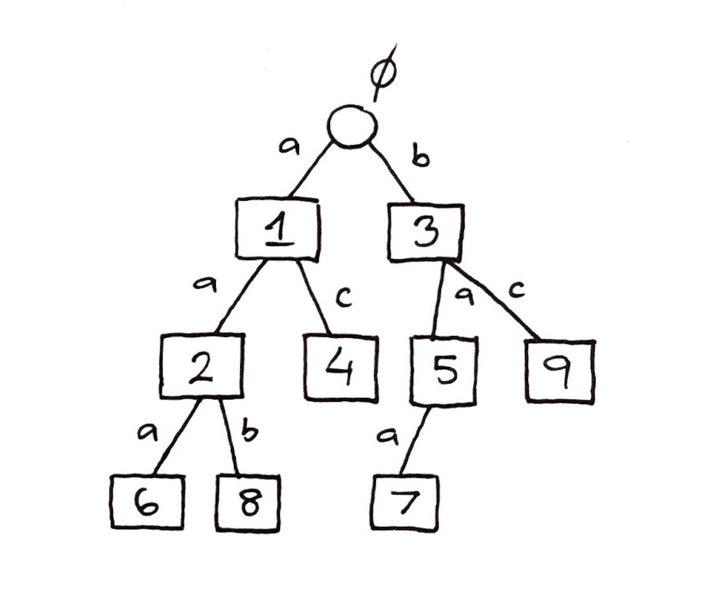

# Compression

### Contents

1. [Introduction](#introduction)
2. [Symbol-by-Symbol Compression](#symbol-by-symbol-compression)
3. [Huffman Trees](#huffman-trees)
4. [Shannon Entropy](#shannon-entropy)
5. [Lempel-Ziv Compression](#lempel-ziv-compression)

## Introduction

Compression is a widely-used algorithm today. The general idea behind it is fairly simple: we take some input (e.g. an image or text) and produce an output that is smaller in size (outputted as bits $y_1y_2…y_n​$). If it is possible to "un-compress" the compressed output back to the origin input, then the compression is said to be **lossless**. Some compression algorithms, such as JPEG image compression, are not lossless—however, we will be only concerned with lossless algorithms here. 

Another thing to note is that there should some sort of limit to compression. For example, if we create a ZIP file and then ZIP that compressed file, its size should not get any smaller! Thus there is a lower bound on how small a compressed file's size can be. 

## Symbol-by-Symbol Compression

If we are given an alphabet of finite size, then one form of compression would involve creating a mapping of symbols to **codewords**. One example of a mapping is:

| Alphabet | Codeword |
| -------- | -------- |
| $a$      | $00$     |
| $b$      | $01$     |
| $c$      | $100$    |
| $d$      | $101$    |
| $e$      | $110$    |
| $f$      | $111$    |

However, when doing this it is possible to create ambiguity, i.e. where a section of bits could be interpreted as multiple different symbols. A good mapping should thus prevent this issue, known as the separation problem. 

Another notion that arises is the following:

> Given that some symbols in an alphabet occur in an input more frequently than others, the symbols of highest frequency should have the codewords of shortest length.

The above would be an example of a **variable-length** code. It is also possible to have **fixed-length** codes (e.g. ASCII characters are all 8 bits).

One solution to the separation problem is **prefix trees**. The general rule is that no codeword can be the prefix for another codeword, e.g. 0101 and 010111 could not both be codewords in the same code. Prefix trees are defined as follows:

* Each leaf represents a symbol of the alphabet
* Each left edge represents a 0 bit, and each right edge represents a 1 bit
  * Following the path down to a leaf will yield its binary code

Now we will now see how to construct an optimal prefix tree, called a Huffman Tree. 

> As a quick aside, we will mention the notion of an optimal prefix code. Suppose that each symbol in an alphabet occurs with some probability $p_i​$, and that each symbol has a codeword of length $l_i​$. Then, we can get a weighted average of the probabilities:
>
> $E(l) = \sum_1^i p_il_i$ 
>
> An optimal prefix code will minimize this value, such that the length of the compressed output is minimized. The length of the output can be expressed as:
>
> $L = $ (Average number of bits per character) $\times$ (number of characters)

## Huffman Trees

A Huffman Tree can be constructed as follows:

* Put all of the symbols (with their frequencies) into a priority queue. 

* Take the two symbols of lowest frequency and connect them with a new internal node. This internal node becomes a new "symbol," whose frequency is equal to the sum of the frequencies of its two children.
* Put the newly-created subtree back into the priority queue and repeat this process until there is only one symbol left, which will be the final Huffman Tree.

> Some notes about what this produces:
>
> * Symbols with lowest frequency will be the farthest down in the tree.
> * There are no nodes with only one child. 
> * If there are $N$ symbols, then the Huffman Tree will have $N$ leaves, $N-1$ internal nodes, and $2N-1​$ nodes in total.

The above algorithm to create a Huffman Tree takes time $O(n\text{log}n)$ overall. The pseudocode is below:

```java
func createHuffman(symbols) {
  // Make a Priority Queue containing pairs (s_i, p_i)
  MAKENULL(PQ)
  
  // Huffman Tree is stored as an array
  for i = (|symbols|-1) downto 1 {
  	  (x, p_x) = PQ.dequeue()
  	  (y, p_y) = PQ.dequeue()
      
      huffman[i].left = x
      huffman[i].right = y
      // Put the new subtree back in the priority queue
      PQ.enqueue(i, p_x + p_y)
  }
    
  return huffman
}
```

Some applications of Huffman Trees include:

* Merging sorted files $s_1, s_2…, s_n$.
  * To do this, create a merge schedule that is based on the sizes of the files
  * A Huffman Tree minimizes the total cost of merging them all together (i.e. smallest files are merged together first)
* Generate random integers where $P(X = i) = p_i$.
  * We can assume that we are given a uniform random number generator in the range $[0,1]$.
  * Given a random number $U$, we start at the root and ask *"Is $U$ smaller than the frequency of the root symbol?"* If yes, then we go left, and right otherwise. We repeat this until a leaf is reached, which will be the symbol that we should return. 
  * This method ensures that we land in the correct "interval" of probability, since deeper nodes will have smaller intervals and hence will be generated randomly less often. 

## Shannon Entropy

Claude Shannon created a model for information in 1948 that subsequently created the field of information theory. One of his key equations was the following:

$S = \sum_i p_i\text{log}_2\frac{1}{p_i}$

Where $S$ is Shannon entropy. The maximum entropy occurs when all outcomes have equal probability—in this case, the entropy is $\text{log}_2N$, where $N$ is the number of outcomes/symbols/etc.

> **Theorem:** Shannon's Theorem
>
> Shannon's theorem states that:
>
> $S \leq min (\sum_i p_il_i) \leq S+1$
>
> Essentially, the weighted average has a lower bound which is the Shannon entropy. 

We can make use of **Kraft's inequality** to verify if a given tree is a binary tree. Kraft's inequality states that:

$\sum_{\text{leaves } i} \frac{1}{2^{l_i}} \leq 1​$

Where $l_i$ is the length of the path to leaf $i$. This can be visualized with the example below:

<center><center/> 

Since this inequality holds, there must exist a binary tree where the leaves all have depth $l_i​$. This tree is the **Shannon-Fano** code, which has the following properties:

* $l_i = \left \lceil \text{log}_2 \frac{1}{p_i} \right \rceil​$
* $\sum_{\text{leaves } i} \frac{1}{2^{l_i}} = \sum_{\text{leaves } i} \frac{1}{2^{\left \lceil \text{log}_2 \frac{1}{p_i} \right \rceil}} = \sum_{\text{leaves } i} p_i = 1​$
  * This shows it is a valid tree, by Kraft's inequality.
* $\sum p_il_i = \sum p_i \left \lceil \text{log}_2 \frac{1}{p_i} \right \rceil \leq S + 1​$
  * This can be shown by observing that $\left \lceil x \right \rceil \leq x+1​$.
  * This code therefore has an expected length of $S+1​$.

## Lempel-Ziv Compression

This method, created in 1977, is still used as the standard compression method today. It works by separating an input by the shortest, not-yet-seen subsequences. Here is an example below:

<center><center/> 

Some explanation:

* Each subsequence is numbered starting from 0
  * 0 is the empty subsequence
* When a new subsequence is found, it is written in the form $(n, symbol)$, where $n$ is a subsequence number. This tells us that we should append $symbol$ to the right of subsequence $n​$ to get the current subsequence. 
* For the $k$-th subsequence $(n, symbol)​$, we can observe the following:
  * $n \leq k-1$ 
  * The number of bits required for $n$ is $\left \lceil \text{log}_2n \right \rceil​$
  * The number of bits required for $symbol$ is fixed at $\left \lceil \text{log}_2|A| \right \rceil$, where $A$ is the alphabet

To implement Lempel-Ziv compression, we make use of a **Digital Search Tree**, which has the following properties:

* Every node in the tree is a subsequence
* Every edge in the tree is the last character of a subsequence
* The root represents subsequence 0, or the empty set

Here is an example:

<center><center/> 

This tree can be built up in one pass through the input, i.e. in $O(n)$ time. Decoding the DST to get the original input is also possible in $O(n)$ time. Digital Search Trees are explained in more depth in the next section.