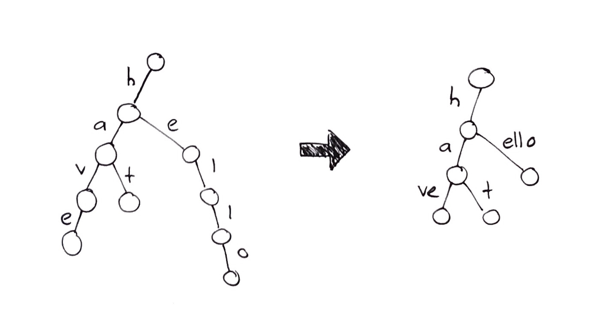

# Strings (Stringology)

### Contents

1. [Introduction](#introduction)
2. [Tries](#tries)
3. [Patricia Trees](#patricia-trees)
4. [Digital Search Trees](#digital-search-trees)
5. [Suffix Tries and Suffix Trees](#suffix-tries-and-suffix-trees)
6. [The Rabin-Karpe Algorithm](#the-rabin-karpe-algorithm)

## Introduction

In this section, the main focus will be finding patterns, or pattern matching, on different types of string inputs. The main goal will be verify if a certain pattern exists in a string. The two main types of input we will look at are input as **N strings** and input as **one large text file**.

For input as $N​$ strings, we will look at tries, Patricia trees and digital search trees. For input as a text file, we will look at suffix tries, suffix trees and suffix arrays.

## Tries

A trie, or prefix trie, is a common data structure that can be used to represent different words in an input. It has the following properties:

* Each node can have up to $|A|$ children, where $A$ is the alphabet.
* The nodes themselves have no key; symbols of the alphabet are instead associated with edges in the trie.
* A leaf represents the end of a word/string. Following a path down to a leaf will give a sequence of symbols, which translates to a word. 
  * Note: sometimes a word may be a prefix of another word, e.g. $go$ and $goalie$; in this case, it would be necessary to mark certain non-leaf nodes as EOW, or end-of-word.

Here is an example below for the words $google, googol, cat​$:

<center><center/> 

## Patricia Trees

Patricia trees are similar to tries, but they have the added benefit of using less space. The main idea is to "compress" a trie by taking prefixes that are common to multiple words and putting the prefix into one edge. This way, there will be less nodes and less edges on average, but the downside is that it can be more difficult to implement. 

The conversion from a trie to a Patricia tree can be shown with some examples:

* We'll do two examples: for the first, our words are $googol$ and $google$; for the second, our words are $hat, have, hello​$. The Patricia trees for these two examples are shown below:

<center><center/> 

<center><center/> 

In a Patricia tree, the number of nodes is $\leq 2n-1$, where $n$ is the number of input words/strings.

> **Proof:**
>
> We know that the number of leaves will be $n​$, since each leaf corresponds to the end of a word. We also know that $N = n + n_1 + n_2 … + n_k​$. However, we can observe that there will be no nodes with one child after the Patricia tree compression; hence $N = n + n_2 … + n_k​$.
>
> We know that $|E| = N-1 = n_1 + 2n_2 … + kn_k​$ in a tree, so:
>
> $|E| = N-1 = 2n_2 + 3n_3… + kn_k​$ 
>
> $2n_2 + 3n_3… + kn_k \geq 2(n_2 + n_3 … + n_k) = 2(N - n)​$ 
>
> This gives us:
>
> $N-1 \geq 2(N - n) = 2N - 2n$
>
> $2n - 1 \geq N​$
>
> Hence the number of nodes $N$ is $\leq 2n-1$.

An exception to this rule can occur if the root has only one child, or if the nodes are ranked. However, in this case we still have $N \leq 2n$.

## Digital Search Trees

Digital Search Trees (DSTs) here are the same ones as mentioned in the previous section on compression. In this case, though, we'll have $N$ binary strings that we want to insert into the DST. As in the Huffman tree, left edges represent a $0$ bit and right edges represent a $1$ bit. The main idea is that each node represents a word, and each node should be inserted into the first available node position.

> Note: the edges in a DST do not necessarily have to represent $0$ and $1$ bits; they can also represent letters (as seen in the previous section with Lempel-Ziv) or any arbitrary symbols.

To find this position for a new string, start at the root of the tree at do the following:

* If there are no nodes in the tree, then the string becomes the root of the DST.
* If there are already nodes in the DST, then start at the first bit of the string. If it is a $0$, go down the left edge from the root; if it is a $1​$, go down the right edge. Then, move on to the next bit in the string.
* Repeat this until an empty spot is reached. This is where the new string should be inserted. 

[This](http://cseweb.ucsd.edu/~kube/cls/100/Lectures/lec15/lec15-4.html) page has a nice example that shows how a DST is constructed step-by-step. The number of nodes in a DST will be equal to the number of input strings. 

## Suffix Tries and Suffix Trees

We will now begin to look at data structures that are more useful when the input is one large text file instead of multiple strings. Suppose our input file is $T$; we then have characters $T[1], T[2]…,T[n]$ in the file, where $n$ is a huge number. We also define a pattern $P$, which has characters $P[1], P[2]…,P[m]​$.

There are two approaches to seeing if the pattern $P$ exists in $T$. The first approach involves preprocessing the data, and the second approach involves pattern matching, i.e. no preprocessing. 

For a suffix trie, we store all $n$ suffixes, i.e. $T[1..n], T[2..n],$ etc. Additionally, we do not need to store the strings themselves, since we can just store integers that tell us where the suffix begins in $T​$. This makes suffix tries space efficient. It is also possible to construct a suffix trie in linear time, though this requires a complex implementation. 

Here is an example of a suffix trie for the word $banana​$:

<center><center/> 

> Note: the suffixes are $banana*, anana*, nana*, ana*, na*, a*,$ and $*$. The asterisk denotes a terminating character. 

To convert a suffix trie to a suffix tree, we simply compress it in the same way as a Patricia tree. The suffix trie from above, when compressed, turns into:

<center><center/>

Suffix trees are useful since they can be used to find all suffixes that contain a pattern $P​$, among other useful operations. Creating a suffix tree is an example of **preprocessing** the input data, which is often expensive but only needs to be done once (assuming the data does not change). This has the benefit of making searches for a pattern take time $O(m)​$ instead of $O(n)​$, where $m​$ is the length of the pattern and $m << n​$. Other methods which don't do preprocessing take time $O(n)​$ to check if a pattern exists.

Another data structure related to suffix trees is the **suffix array**, which contains all of the suffixes in lexicographical (alphabetical) order. Each slot in the array stores an integer that points to the start of the suffix in $T​$. This data structure enables searching for a suffix efficiently with binary search.

## The Rabin-Karpe Algorithm

The previous three data structures we saw all involved preprocessing the input data. However, it is also possible to search for a pattern "on-the-fly," which is what tools like grep do. 

The naive way of finding a pattern in a string involves the so-called sliding window approach. The idea is to start at $T[1]​$ and compare, character-by-character, every character from there to $T[m]​$ with the characters at the same indices in $P​$. If every character matches, then the pattern is found. Otherwise, $P​$ is shifted over by one and the process repeats. While this approach works, it takes time $O(n \cdotp m)​$, which is slow. 

The Rabin-Karpe algorithm for pattern matching gives us a technique that can see if a pattern exists in $O(n)​$ time, on average. It uses the sliding window technique, but with a clever trick to get a much faster runtime. The algorithm is explained below:

* Rabin-Karpe makes use of a **hash function**, which computes a hashed value for a given set of input characters, i.e. `hash(P[1], P[2]..., P[m])` or simply `hash(Pattern)`. An example hash function could be:

  $(\sum_1^m P[i]) \text{ mod } p$, for some $p$

  > Note: we assume all values returned by the hash function are equally likely.

* This hash function is then used on the input string as well. The algorithm hashes subsequences of length $m$ from the input string and then compares this to the hashed value of $P$. If they are not the same, then we know for sure that that subsequence does not match $P​$. However, if the hashed values *are* the same (potential match), then it is likely *but not guaranteed* that we have found a true match. We must compare the two strings character-by-character to see if they are indeed the same.

* If we compute hashed values from scratch for every subsequence of $T​$, then the Rabin-Karpe algorithm is no faster than the naive sliding window approach. This is where the trick comes in:

  * Suppose we have the hashed value from `hash(T[i], T[i+1]...,T[i+m])`. Instead of computing `hash(T[i+1], T[i+2]...,T[i+m+1])`, we can get that same value by doing:

    `hash(T[i+1]...,T[i+m+1]) = hash(T[i]...,T[i+m]) - hash(T[i]) + hash(T[i+m+1]) `

    Essentially, when we shift our window over by one slot, one character will no longer be in the window and one character will enter the window from the right. All of the other $m-2​$ characters are still in the new window, so it would be inefficient to recompute their sum. Instead, we simply subtract the hashed value of the removed character and add the hashed value of the new character. This means computing new hashes for $T​$ takes $O(1)​$ time per hash, and $O(n)​$ time overall.

* The algorithm can degrade to worse than $O(n)$ time if there are many partial matches that do not lead to a true match, since each check takes $O(m)$ time. However, with a good hash function it is unlikely that a partial match will not be a true match, so the algorithm is safely $O(n)$ on average. 

The pseudocode is below:

```java
func rabinKarpe(T, P) {
		// Compute the hashed value of the pattern
  	pHash = hash(P)
  
  	// Compute the hash of the first m characters of T
  	tHash = hash(T[1..m])
  
  	for i = 1 to n-m {
   			if (tHash = pHash) { // Potential match
    				pIndex = 1
    				matchFound = true
    	
      			for j = i to j+m {
      					// Not a true match
        				if (P[pIndex] != T[j]) {
                  	matchFound = false
                    break
                }
        				pIndex++
     				}
      			if (matchFound) return i // Return index of pattern in T
    		}
    
    		// Update value of tHash
    		tHash = tHash - tHash(T[i]) + tHash(T[i+m+1])
  	}
  	return -1 // Pattern not found in T
}
```