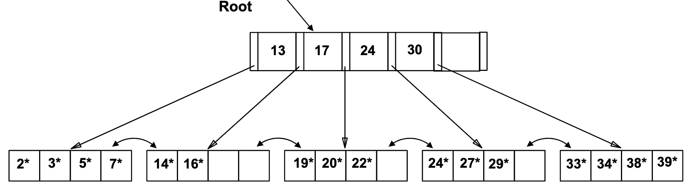
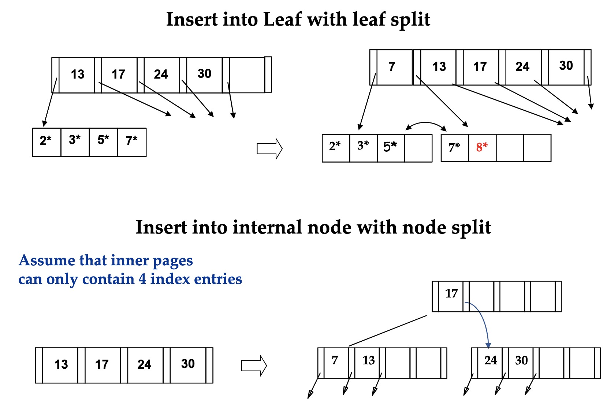
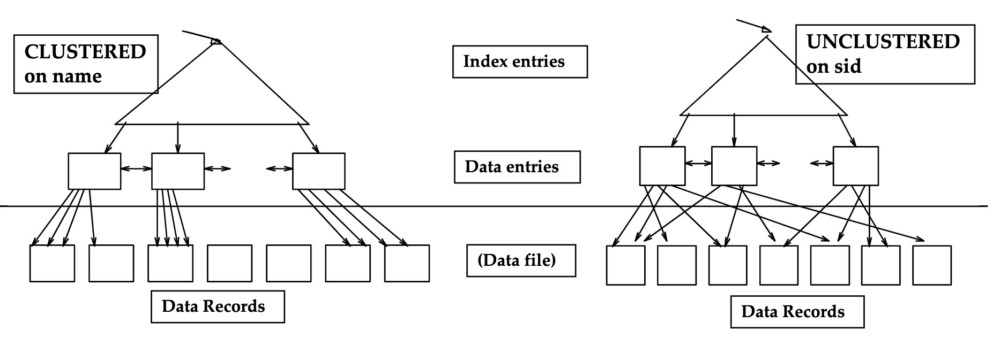

# Database System Internals

1. [Disk and Buffer Management](#disk-and-buffer-management)
2. [Indexing](#indexing)
3. [Index Classification](#index-classification)

### Disk and Buffer Management

* Memory hierarchy
  * Goal: obtain highest possible access speed while minimizing the total cost of the memory system
  * In terms of access speed: Registers > Cache > Main Memory > Magnetic Disk > Magnetic Tape
  * Reverse the order above for cost
  * CPU deals with cache and main memory
  * I/O processor deals with main memory and magnetic disks/tapes
* Main memory and above can operate on individual bytes
  * Cannot do this on secondary storage (magnetic disk and tapes)!
    * Data is accessed in chunks (blocks)
* Magnetic disks
  * The **disk head** moves closer/farther away from the spindle of the magnetic disks to perform reads and writes
  * Disks are split up into **sectors**
    * i.e. disk slices
    * The minimal unit of data that can be read from/written to the disk
  * Data is accessed sequentially
    * Takes a long time to move the disk head, so it makes sense to read more data with each read
  * The disk can be abstracted as a collection of blocks
* Magnetic disks can be used in combination with solid state drives (SSDs)
  * SSDs are more expensive but are faster than magnetic disks
  * SSDs can store data that is accessed more frequently
* Architecture
  * Upper Layer <-> Cache/Buffer Manager <-> Buffer (volatile) <-> Secondary Storage (stable)
* Main memory
  * Can hold up to a specific number of blocks/pages
  * Data must be in RAM for DBMS to operate on it
  * Table of (frame #, pageID) pairs is maintained
* Loading a page from disk
  * If requested page is already in the buffer, then return it
  * If not:
    * If there is an empty frame, choose that frame as the one to fill
    * If there are no empty frames, a frame must be replaced
    * If the frame that is being replaced is *dirty* (i.e. it was modified) then it should be written to the disk as well
* Page pins
  * When loading a page from disk:
    * Replacement frame must have pin counter of 0
    * After new page is loaded, set pin counter of that frame to 1
  * When requesting a page that is in the buffer, increment the pin counter
  * After the operation has finished, decrement the pin counter (and set dirty bit if page has been modified)
  * Frame is choosen for replacement by a replacement policy
    * Only unpinned page can be chosen (pin count = 0)
    * e.g. LRU
* Operating systems already have disk space and buffer management, why not let the OS manage these tasks?
  * Differences in OS support: portability issues
    * Cannot give the same experience across all platforms
  * OSs have some limitations, e.g. files can't span disks
  * Buffer management in DBMS requires abaility to:
    * Pin a page in buffer pool, force a page to disk (important for implementing CC and recovery)
    * Adjust replacement policy and pre-fetch pages based on access patterns in typical DB operations
* Record format: fixed length
  * Length of field (attribute) depends on its type
  * Works with fixed-length types (e.g. integers)
  * Strings must be padded
  * Offset of each field is easy to calculate
  * Downside: potentially lots of wasted space
* Record format: variable length
  * Contains pointers at the start of the record which point to each attribute (later in the record)
  * Can use the address of the next pointer to calculate the length of attributes
    * i.e. # bytes = address_2 – address_1
    * A length of zero can indicate a null value
  * Efficient storage of nulls (special *don't know* value)
  * Small directory overhead
* Record ID
  * Internal identifier of a record: (pageID, slot #)
* Each page contains:
  * A pointer to the start of free space
  * A **slot directory** which contains pointers to the start of each record, as well as the length of each record
  * The slot directory and the actual records themselves start at opposite ends of the page

### Indexing

* How should we estimate the costs for executing a statement?

  * Number of I/Os
  * CPU execution cost
  * Network cost in distributed system

* Assumption in this course: I/O cost >>> CPU cost

  * Real systems also consider CPU

* Simplifications

  * Only consider disk reads, ignore writes
  * Only consider number of I/Os and not the individual time for each read (ignores page pre-fetch)

* Typical operations

  * Scan over all records

    ```sql
    SELECT * FROM students
    ```

  * Point query

    ```sql
    SELECT * FROM students WHERE sid = 100
    ```

  * Equality query

    ```sql
    SELECT * FROM students WHERE startyear = 2015
    ```

  * Range search

    ```sql
    SELECT * FROM students WHERE startyear > 2012 AND startyear <= 2014
    ```

  * Insertion

    ```sql
    INSERT INTO students VALUES (23, 'Bertino', 2016, ...)
    ```

  * Deletion

    ```sql
    DELETE FROM students WHERE sid = 100
    ```

* Assume each relation is a file

* Heap files

  * Linked, unordered list of all pages of the file
  * How does it perform?
    * **Retreiving all records:** OK, since you have to retrieve all pages anyways
    * **Point query on unique attributes:** not great, have to read half (on average) of all pages to return one record
    * **Range query or equality search on non-primary key:** not great, have to read all pages to return a subset of records
    * **Insertion**: well, since you can insert anywhere
    * **Deletions/updates**: depends on WHERE clause

* Sorted files

  * Records are ordered according to one or more attributes of the relation
  * Performance:
    * **Retreiving all records:** OK, since you have to retrieve all pages anyways
    * **Point query on unique attributes:** good, can use binary search to find the first qualifying page in logarithmic time
    * **Range query or equality search on non-primary key:** good, can also use binary search; adjacent pages may have additional matching records
    * **Insertion**: not good, have to find proper page and overflow is possible
    * **Deletions/updates**: depends on WHERE clause; update might lead to restructuring of pages
    * **Sorted output:** good if ORDER BY is used on a sorted attribute

* Indexes

  * Even a sorted file only supports queries on sorted attributes
  * Solution: build an index for any attribute (or collection of attributes) that is frequenty used in queries
    * Additional information that helps with finding specific tuples faster
    * We call the collection of attributes over which the index is constructed the **search key attributes** for the index
    * Any subet of the attributes oof a relation can be the search key for an index on the relation

* Indexes should be used when there are thousands or millions of records

* Creating an index in DB2

  ```sql
  CREATE INDEX ind1 ON students(sid);
  
  DROP INDEX ind1;
  ```

* B+ trees

  * Each node/leaf represents *one page* (since the page is the transfer unit to disk)
  * Leaves contain data entries (denoted as k*)
    * For now, assume each data entry represents one tuple
    * The data entry consists of two parts: value of the search key (k) and record identifier
    * Data entry is **not a tuple** but a pointer to a tuple
  * Root and inner nodes have auxiliary *index entries*
    * These contain a value and a page pointer, which points to a child node in the tree
  * A B+ tree is height-balanced
    * Each path from root to tree has the same height
  * F = fanout = number of childen for each node
    * ~number of index entries stored in each node
  * N = number of leaf pages
  * Insert/delete at $log_FN$ cost
  * Minimum 50% occupancy (except for root)

* Examples

  <center><center/> 


  * `SELECT * FROM skaters WHERE sid = 5`
    * Example tree has height 2
    * Search begins at root and key comparisons direct it to a leaf
    * Number of pages accessed: 3
      * Root, leaf, and data page with corresponding record
    * Number of I/O accesses
      * Depends on how much of tree is in memory
      * Rough assumption: Root is always in memory, index leaves and data pages not in memory upon first access
  * `SELECT * FROM skaters WHERE sid >= 33`
    * I/O costs:
      * One for leaf page, four for data pages with records
    * Good for equality search *and* range queries (depending on the range)

* Inserting a data entry

  * Find correct leaf $L$
  * Put data entry into $L$
    * If $L$ has enouogh space, then done
    * Otherwise, we need to split $L$ into $L$ and a new node $L_2$
      * Redistribute entries evenly, and *copy up* middle key
      * Insert index entry pointing to $L_2$ into parent of $L$
  * This can happen recursively
    * To split index node, redistribute entries evenly but **push up** middle key (instead of copying up)
  * Splits grow the tree, and root splits increase the overall height
  * Example: inserting 8* 

<center><center/>

* Indirect indexing I
  * So far: k* = <k, rID of data record with search key value k>
  * On non-primary key search key: (2015, rid1), (2015, rid2), (2015, rid3)
    * Several entries with the same search key side-by-side
* Indirect indexing II
  * <k, list of data records with search key k>
  * On non-primary key search key: (2015, (rid1, rid2, rid3...)), (2016, (rid...))
* Comparison
  * First requires more space, since the search key is repeated
  * The second has variable-length data entries
  * Second can have large data entries that span a page
* Direct indexing
  * Instead of data entries in index leaves containing record IDs, they could contain the entire tuple
  * No extra data pages
  * This is kind of a sorted file with an index on top

### Index Classification

* Primary vs. Secondary
  * If search key contains primary key, then it is called a **primary** index
    * Unique index: search key is primary key *or* unique attribute
* Clustered vs. Unclustered
  * Clustered:
    * Relation in file sorted by the search key attributes of the index
  * Unclustered
    * Relation in heap file or sorted by an attribute different to the search key attribute of the index
  * A file can be clustered on at most one search key
  * Cost of retrieving data records through index varies *greatly* based on whether index is clustered or not

<center><center/>