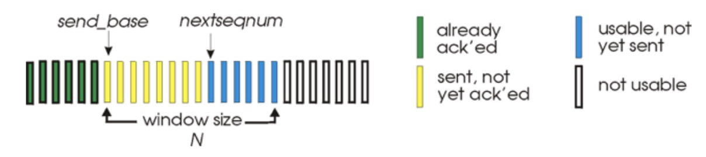
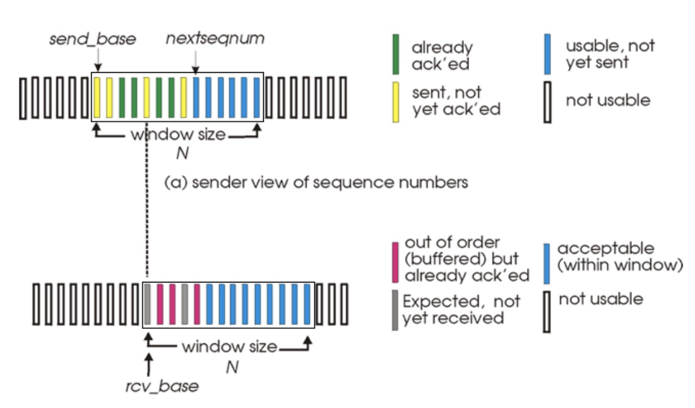

# Transport Layer

1. [Overview](#overview)
2. [Stop-and-Wait](#stop-and-wait)
3. [Pipelined Protocols](#pipelined-protocols)
4. [Go-Back-N](#go-back-n)
5. [Selective Repeat](#selective-repeat)
6. [TCP](#tcp)
7. [TCP Flow Control](#tcp-flow-control)
8. [Congestion Control](#congestion-control)

### Overview

* Transport services and protocols
  * Provides logical communication between processes running on different hosts
  * Transport protocols run in end systems
* Difference between transport vs. network layer services:
  * Network layer: data transfer between *end systems*
  * Transport layer: data transfer between *processes*
    * Relies on and enhances network layer services
* IP on its own only offers unreliable, best-effort service
  * Packets may be dropped, delivered out of order, or corrupted during transmission
* Transport layer is responsible for:
  * Congestion control
  * Flow control
  * Reliable data transfer
* Transport layer protocols: TCP and UDP
  * TCP: provides reliable, in-order delivery
    * Performs congestion control, flow control, and requires a connection to be established
  * UDP: provides best-effort service
    * No connection is established before data transmission
    * Packets may be lost or delivered out of order

### Stop-and-Wait

* Only one **unacknowledged** packet allowed in flight
* Ackowledgements (ACKs): receiver explicitly tells sender that packet was received successfully
* Sender waits until it receives confirmation of correct receipt before sending the next packet
* Not very efficient because only one packet is sent per RTT
* The receiver ACKs an error-free packet
  * Negative acknowledgement (NAK) when error detected
  * Sender knows to retransmit the same packet
* What if a ACK/NAK is corrupted?
  * A NAK could look like an ACK or vice versa
  * If the packet is sent again then the receiver would receive two copies of the packret and the data stream passed to the application would be incorrect

* Handling duplicates
  * Put a **sequence number** on each packet
  * In the stop-and-wait protocol, we only need two sequence numbers: 0 and 1
* NAK-free stop-and-wait
  * NAKs add unnecessary complexity at both ends
  * Instead of sending a NAK, receiver ACKs the last packet received without errors
    * A duplicate ACK at the sender signals an error
    * Sender knows that it needs to retransmit
    * Instead of a NAK, send ACK for previous sequence number
* New problem: packetts get dropped
  * What if an ACK is lost?
  * Use timers
  * Sender retransmits if no ACK is received within a reasonable amount of time

### Pipelined Protocols

* An obvious disadvantage of the stop-and-wait protocol is the wasted channel capacity that is caused by only allowing one packet to be unacknowledged
* In a pipelined protocol, the sender can send out multiple in-flight packets
  * This lends itself to a need for more sequence numbers
  * Also a need to introduce buffering at the sender so that packets can be retransmitted if necessary (receiver may also have buffering)

* Pipelining significantly improves channel utilization and efficiency
  * However, it becomes much more challenging to respond to dropped packets, corrupted packets, and out-of-order arrivals

### Go-Back-N

* On sender side

  

 

  * Window of up to N consecutive unACK'd packets allowed
  * `ACK(n)`: acknowledges all packets up to and including sequence numberr $n$ (cumulative ACK)
    * Sender may receive duplicate ACKs
  * Maintains timer for each in-flight packet
    * Can be a single timer or one for each packet
  * `timeout(n)`: retransmit packet $n$ and all higher sequence number packets in window

* The sender may receive duplicate ACKs, because if the receiver gets an out-of-order segment, it will re-transmit the ACK for a contiguous block of packets

  * Example: receiver sends ACK(n) and then receives packet $n+2$
  * It will retransmit ACK(n) to indicate that it is expecting packet $n+1$

* If an ACK(n) is received and it passes the error checks, then the `send_base` will be updated to equal the sequence number of the unACK'd segment with the smallest sequence number

  * If there are no unACK'd packets, then `send_base` is moved up to `nextseqnum`

* Receiver side

  * ACK-only: always send ACK for correctly-received packet with highest *in-order* sequence number
    * May generate duplicate ACKs
    * Need only to remember `expected_seq_num`
    * e.g. if packets 1,2,3,6,9 are received, send ACK(3) and set `expected_seq_num` to 4
  * Out-of-order packet
    * Discard (don't buffer), receiver has no buffering!

### Selective Repeat

* Receiver individually ACKs all correctly received packets
  * Buffers packets as needed for eventual in-order delivery to upper layer
  * ACKs are no longer cumulative
* Sender only resends packets for which an ACK is not received
  * Sender timer for eack unACK'd packet
* Sender window
  * N consecutive sequence numbers
  * Limits sequence numbers of sent, unACK'd packets

 

* The above image shows the relationship between the sender window and receiver window

* Protocol operations

  * Sender

    * If data is received from above, check if there is an available sequence number in the window. If yes, form a packet with that sequence number and send it; if not; wait

    * If a timeout occurs for packet with sequence number $n$, retransmit that packet and restart its timer
    * If an ACK is received with a sequence number $n$ that lies in the sender window, mark that sequence number as received
    * If $n$ was the lowest unACK'd sequence number in the window, advance the window to the next lowest unACK'd sequence number

  * Receiver

    * If a packet is received with a sequence number $n$ inside the receiver window, send an ACK for packet $n$
    * If it is out of order, buffer it; if in-order, deliver it to the application layer (if it fills a gap, deliver all packets that are now in-order)
    * If a packet has a sequence number below the receiver window (but within N numbers) then send an ACK for it

* How many sequence numbers do we need in selective repeat if we have a window of size N?

  * Sequence numbers are cyclic
  * If the window size is N, we need at least 2N sequence numbers (since the receiver window can be at most N packets ahead of the sender window)
  * Remember that ACKs can get lost!

### TCP

* Transmission Control Protocol (TCP) is a unicast (one-to-one) reliable transfer protocol used in the Internet
* It is connection oriented; involves a handshaking process to set up the connection
* Provides reliable, in-order byte streams to an application
* There are buffers at the sender and receiver
  * Data can be transmitted in both directions
* It is a pipelined protocol
  * A congestion control algorithm determines the window size at the sender
* There is a flow control mechanism to ensure that the sender does not transmit at a rate faster than the receiver can handle
* Each TCP packet contains a sequence number and an ACK number
* During the connection setup, the end-points agree on a starting sequence number
* In subsequent packets, the sequence number increments by *the number of bytes in a segment*
  * The first sequence number might be 42, and then if that packet contains a single byte the next sequence number will be 43
  * If it contained 100 bytes, then the next sequence number would be 142
  * The ACK number contains the sequence number of the next byte expected from the other side—it is a cumulative acknowledgement
* Round trip and timeout
  * How do we set an appropriate timeout value?
    * Should be longer than the RTT, but RTT varies
  * If it's too short, then we get premature timeouts
    * Unnecessary retransmissions
  * If it's too long, then we react slowly to segment loss
    * Waste lots of time when a packet is legitimately lost
* How can we estimate RTT?
  * SampleRTT: measured time from segment transmission until ACK receipt
  * SampleRTT will vary; we want the estimated RTT to be "smoother"
    * Can average several recent measurements instead of using only the current SampleRTT
    * `EstRTT = (1-a)*EstRTT + a*SampleRTTT`
    * Exponential weighted moving average
    * The influence of the past sample decreases expontentially fast; typical value is $a=0.125$
* Setting the timeout
  * EstimatedRTT plus a safety margin
  * The safety margin should be proportionate to the standard deviation of the EstimatedRTT
* TCP fast retransmit
  * The timeout period is often relatively long
    * Long delay before resending a lost packet
  * We can detect lost segments via duplicate ACKs
    * Sender often sends many segments back-to-back
    * If a segment is lost, there will likely be many duplicate ACKs
  * If a sender receives 4 ACKs for the same data (triple duplicate ACK):
    * Resend unACK'd segment with smallest sequence number
    * Likely that the unACK'd segment was lost, so don't wait for timeout

### TCP Flow Control

* The receiver controls the sender so that sender won't overflow receiver's buffer by transmitting too much, too fast
* Recall that flow control refers to preventing a router/receiver from being overwhelmed
* Receiver advertises free buffer space
* `rwnd` value (amount of free buffer space) in TCP header of receiver-to-sender segments
* `RcvBuffer` size set via socket options (typical default is 4096 bytes)
  * Many operating systems autoadjust this
* The sender limits the amount of unACK'd data to the receiver's `rwnd` value
  * This guarantees the receive buffer will not overflow 

### Congestion Control

* Congestion
  * Informally: too many sources sending too much data too fast for the **network** to handle
    * Leads to very long queues at routers within the network
  * Different from flow control!
* Side effects
  * Lost packets (buffer overflow at routers)
  * Long delays (queueing in router buffers)
* Causes of congestion (1)
  * Example: two senders transmit data through a common router; we assume the router has an infinite buffer
  * Output link capacity is $R$
  * Each sender can transmit at a maximum rate of $R/2$
  * As the combined transmission rate approaches the outgoing link capacity $R$, the delay increase dramatically
    * If the combined rate exceeds $R$, then the queue will grow indefinitely
* Causes of congestion (2)
  * The router now has a *finite* buffer
  * When there is a finite buffer, the sender will retransmit a lost packet
  * $\lambda_{in}$: original data
  * $\lambda'_{in}$: original data plus retransmitted data
  * In the ideal case (with no retransmission) the output data rate equals the offered load (until we reach capacity)
    * This can only occur when the sender has perfect knowledge of when the router will have space in its buffer, so no losses will occur
* Causes of congestion (3)
  * Let's now assume that packets are lost, but the sender knows exactly which packets have been lost
  * The throughput on the output link will be lower than at the input
    * Since the sender only retransmits lost packets, this means that every packet coming out of the output link is a useful packet
* Causes of congestion (4)
  * Even more realistic: assume the receiver gets duplicate packets
  * The sender won't know whether a packet has been lost or simply delayed for a very long time
  * There will be duplicate packets transmitted, so the throughput on the output link will drop even further

* Costs of congestion

  * More work (retransmissions) required to achieve the same "goodput"
  * Duplicates will be wasting valuable resources
  * When a packet is dropped, any upstream transmission capacity used for that packet was wasted!

* Approaches toward congestion control

  * End-to-end congestion control
    * No explicit feedback from network
    * Congestion is detected by observing packet delays and loss rates
    * This is the approach taken by TCP (by default)
  * Network-assisted congestion control
    * Routers provide feedback to end systems
    * Single bit indicating congestion, or explicit rate that the sender should send at

* The congestion control mechanism in TCP attempts to find the fastest transmission rate that does not lead to congestion

  * It is a decentralized algorithm because many end-to-end systems are using the same resources
  * An ACK indicates that a segment has been received, and so the sending rate can likely be increased
  * A loss or very large delay may indiciate a congested network, and so the sending rate should probably be decreased

* TCP maintains a variable called `cwnd` that controls the window size

  * When data is available, this means that TCP will approximately send `cwnd` bytes in one RTT

  * The rate is then: 

    $rate \approx \frac{cwnd}{RTT}$

* TCP slow start

  * When connection begins, increase rate *exponentially* until first loss event (e.g. double the rate for every RTT)
  * Rate increase is achieved by increasing `cwnd` by 1 for every packet is acknowledged

* Detecting and reacting to loss
  * If loss is detected by a timeout
    * This is indicative of severe congestion, so the window size is set to 1 MSS (mean segment size) and TCP re-enters slow start
    * Older versions always set the value to 1
  * If loss is detected by triple duplicate ACK
    * Window size (rate) is reduced by a factor of 2

* Switching from slow-start to congestion avoidance
  * When should we switch from exponential increase to linear increase?
    * When `cwnd` gets to half of its value before a timeout occured
  * Use a variable `ss_thresh`
  * On a loss event, `ss_thresh` is set to half of `cwnd`'s value just before the loss event

* Explicit Congestion Notification (ECN)

  * Recent versions of TCP also support an ECN mechanism
    * Both endpoints must agree to use it
    * Underlying network needs to support it
  * Two bits are used in the IP header
    * `00`: non-ECN capable transport
    * `10` or `01`: ECN capable transport
    * `11`: congestion encountered
  * Congestion indication can be done before a loss occurs, so end systems can react more 

* Active queue management

  * Random Early Detection (RED)
    * Monitors queue length (exponentially weighted moving average)
    * Marks packets probabilistically (i.e. set the congestion encountered flag)
    * If buffer is almost empty, then don't mark any packets
    * As queue increases, probability of marking increases
  * Weighted RED
    * Allows different thresholds for different packet priorities

* TCP throughput

  * Ignore slow-start
  * Let $W$ be the window size when loss occurs
  * When the window size is $W$, throughput is $W/RTT$
  * Just after loss, window drops to $W/2$, and throughput to $W/2RTT$
  * Average is $0.75W/RTT$

* Throughput example

  * One user, link bandwidth with $R = 1$ Mbps
  * RTT = 100 ms
  * MSS = 1000 bits
  * Assume that packets are dropped as soon as throughput exceeds $R$ (no queueing)
  * Assume instantaneous feedback about drop 
  * Assume `ss_thresh` initialy greater than 100,000 bits
  * How long does it take to reach steady-state (seconds)?
    * Window is initially 1000 bits in size (1 MSS)
    * Doubles every RTT
    * Need $2^n > 100$, $n=7$
    * Need 700ms to enter steady-state
  * What is the average throughput in steady state?
    * After loss: window drops to 50,000 bits
    * Grows linearly, so average throughput is 75,000 / 100ms
    * Average throughput: 750 kbps

* TCP loss rates

  * From the time when the transmission rate goes from $W/2RTT$ back up to $W/RTT$, only one packet is lost (at the very end)

  * We need to sum from $\frac{W}{2}$ to $W$

    * This is equivalent to summing from 1 to $W$ and then subtracting the sum from 1 to $\frac{W}{2}-1$

      $\frac{W(W+1)}{2} + \frac{(\frac{W}{2}-1)(\frac{W}{2})}{2}$

      $= \frac{3}{8}W^2 + \frac{3}{4}W$

    * Then, the loss rate $L$ is:

      $L = \frac{1}{\frac{3}{8}W^2 + \frac{3}{4}W}$

    * Throughout is equal to $\frac{0.75\times W\times MSS}{RTT}$

    * If we take an upper bound on $W$, then $W = \sqrt{\frac{8}{3}L}$

    * Finally:

      $throughput=\sqrt{\frac{8}{3}} \frac{MSS}{RTT\times \sqrt{L}}$

* TCP fairness
  
  * If $K$ TCP sessions share the same bottleneck link with bandwidth $R$, then each should have average rate $R/K$
* Multimedia apps (e.g. video) often do not use TCP
  * Don't want the rate to be throttled by congestion control
  * Instead, use **UDP**
    * Send audio/video at a constant rate and tolerate packet loss
* TCP latency modelling
  * Two cases to consider:
    * Slow sender (big window): still sending when ACK returns
      * Time to send window > time to get first ACK
      * $W\times MSS/R < RTT + MSS/R$
    * Fast sender (small window): wait for ACK before sending more data
      * Time to send window < time to get first ACK
      * $W\times MSS/R > RTT + MSS/R$
  * Assumptions:
    * Assume one link between client and server with rate $R$
    * Fixed congestion window, $W$ segments
    * No retransmission (no loss, no corruption)
    * $O$: object size (bits)

