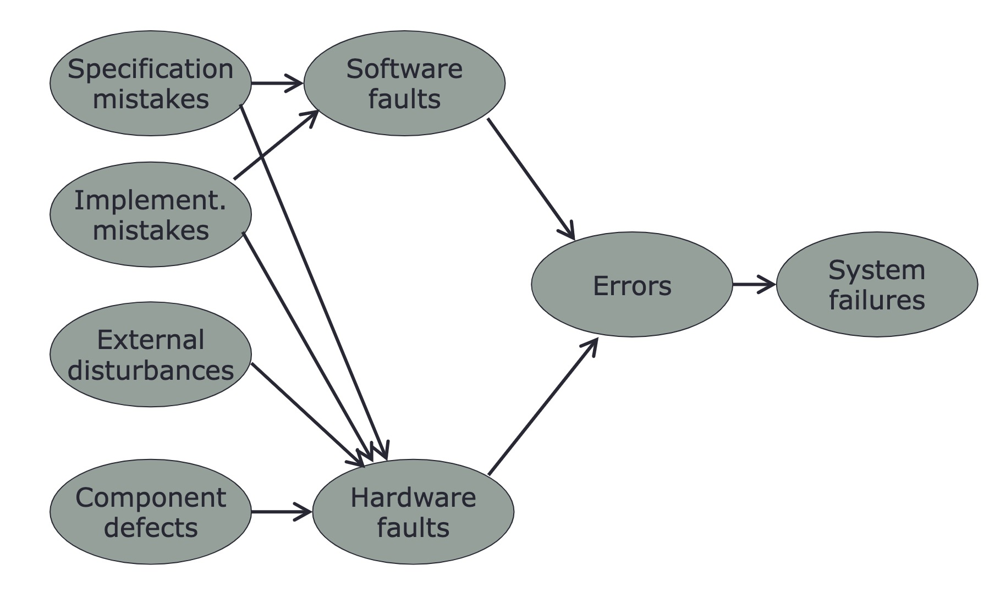

# Introduction

1. [Introduction](#introduction)
2. [Applications of Fault-Tolerant Computing](#applications-of-fault-tolerant-computing)
3. [The Three-Universe Model](#the-three-universe-model)
4. [Causes of Faults](#causes-of-faults)

### Introduction

* What is a fault-tolerant system?
  * One that can continue to correctly perform its specified tasks in the presence of hardware failures and software bugs
  * Fault tolerance is the attribute that enables a system to achieve fault-tolerant operation
  * Denotes performing computing in a fault-tolerant manner
* Why do we need fault tolerance?
  * Practically impossible to build systems that do not fail
* Early digital computers made extensive use of fault-tolerant designs, since they used unreliable basic components
* As components became reliable, fault-tolerance became less of an issue
* With certain mission-critical applications fault-tolerance is again an issue!
* Requirements to be met for fault-tolerance
  * Reliability
  * Availability
  * Safety
  * Performability
  * Dependability
  * Maintainability
  * Testability
* Reliability
  * The reliability $R(t)$ of a system is a function of time defined as the conditional probability that the system will perform correctly throughout the interval $[t_0, t]$ given it was correct at $t_0$
  * Reliability is used to characterize systems where momentary failures are unacceptable
  * If repair is impossible, then the time interval can be fairly long (e.g. tens of years)
  * Fault-tolerance improves reliability
  * In general, **fault-tolerant systems need not have high reliability**
    * Likewise, highly reliable systems do not need to be fault-tolerant
* Availability
  * Availability $A(t)$ is also a function of time, defined as the probability that the system is operating correctly and is available to perform its function at time instant $t$
  * $A(t)$ is also known as the point availability
  * Availability differs from reliability because the latter depends on a time interval
  * A system can be highly available and yet experience frequent but very short periods of inoperability
  * Available depends on:
    * How often a sytem becomes inoperable
    * How quickly the system gets repaired and restored to its original working order
  * Availability is important for systems that are meant to provide service as often as possible
    * e.g. web/cloud computing systems, banking applications
* Safety 
  * Safety $S(t)$ is the probability that a system will either perform its functions correctly or will discontinue its operation without disrupting the overall operation
  * A measure of the fail-safe capability of the system 
  * Not the same as reliability
* Performability
  * In many cases it is desirable to design systems that continue to operate correctly after some component failure (with diminished performance levels)
  * Performability $P(L, t)$ of a system is the probability that the system performance will be at or above level $L$ at time instant $t$
  * Performability measures the subset of functions performing correctly
* Maintainability
  * Maintainability $M(t)$ is the probability that a failed system can be restored to operational condition with a specified period $t$
  * Restoration includes locating the problem, physically repairing the system, and bringing the system back to operation
* Testability
  * The ability to test for certain attributes within a system
* Dependability
  * Encompasses the concepts of reliability, availability, safety, maintainability, performability, and testability
  * Measures the **quality of service** a particular system provides

### Applications of Fault-Tolerant Computing

* Fault-tolerant computing is used in a number of important fields, including:
  * Long-life applications
    * These applications require a very high probability of still being operational after a very large time interval (e.g. 10 or 20 years)
    * Examples: unmanned spacecraft, storage into the future
  * Critical-computation applications
    * These applications want a system that ensures correct computations despite failures within the system
    * Example: fault-tolerant mucroprocessor systems
  * Maintenance postponement applications
    * When maintenance operations are costly or inconvenient, fault-tolerance is used to postpone them
  * High-availability applications
    * Banking and e-commerce expect their services to be available most of the time

### The Three-Universe Model

* Three fundamentals concepts: fault, error, and failure
* Fault
  * Physical defect, imperfection, or flaw that occurs in some hardware or software component
* Error
  * A manifestation of a fault
  * A deviation from accuracy and correctness
* Failure
  * The non-performance of some action that is due or expected
  * Caused by errors
* The three-universe model
  * **Physical universe:** where faults happen. Contains semiconductor devices, mechanical devices, printers, power supplies, software, etc.
  * **Informational Universe:** where errors happen. Errors affect units of information such as data words within a computer. An error has occurred when some unit of information becomes incorrect
  * **External Universe:** where the user or system ultimately sees the faults or errors (i.e. where failures occur)
* There is a cause-effect relationship between these three concepts
* This model leads to two important parameters
  * **Fault latency:** the time it takes for a fault to cause an error
  * **Error latency:** the time it takes for an error to cause a failure

### Causes of Faults

* Faults can be caused by issues in:
  * Specifications
  * Implementation
  * Components
  * External factors
* Specification
  * Specification mistakes include incorrect algorithms, architectures, or hardware/software design specifications
  * A bad design could still perform correctly under some conditions
* Implementation
  * Defined as the process of turning specifications into concrete implementations
  * Mistakes include faults due to poor design, poor component selection, poor construction, and software coding mistakes
  * The system can still be working correctly for some input conditions
* Components
  * Faults due to manufacturing imperfections and component wear out 
* External factors
  * Examples: radiation, electromagnetic interference, and extreme weather

* Causes of faults summary:

 

### Design Philosophies

* Fault avoidance
  * Techniques to prevent faults from ever occuring
  * Can include design reviews, component screening, testing, and other QA methods
* Fault masking
  * Techniques to prevent faults from introducing errors into the informational structure of the system
  * Example: error-correcting memories
* Fault-tolerance
  * The ability of a system to continue despite faults
  * Can be achieved in different ways (fault masking is one approach)
  * Can be done by following these steps: detect, locate, and recovery
* Fault containment
  * Confine faults to localized environments and prevent them from propagating thoughout a system